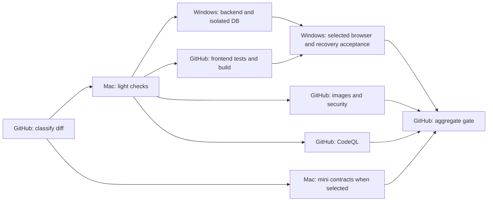

# CI runner and scenario policy

CI is orchestrated by GitHub Actions. The stable required check remains **merge gate / ready PR**.
It must require exact success for every selected route and acceptance; missing, skipped,
failed or cancelled selected jobs never mean merge-ready.

## Scenarios

- Content: established declaration-only content plus immutable release/scientific rules,
  content regression and the existing all-Bundle dependency closure with a real isolated
  database and actual-package FINAL/lifecycle tests. An executable content boundary
  failure blocks the route; it is not permission to publish.
- Presentation: narrow existing CSS/design-doc allowance with frontend lint/types/build,
  plus any selected visual/accessibility acceptance.
- Frontend: UI source changes without measurement runtimes/scorers, persistence engines,
  backend/API/schema, dependencies, shared configuration or CI changes. Keep lint/types,
  full frontend regression, production build, unchanged backend build for real API
  acceptance, full existing main browser scenarios, frontend image/security/CSP checks,
  CodeQL, and selected media/visual acceptance. Do not run unrelated backend full
  regression or backend image builds.
- Content + frontend: union of both selected routes.
- Platform/migration/unknown: existing full backend regression, guarded isolated database,
  independent performance SLA, frontend, browser, Docker and CodeQL. Schema/runtime/ops
  changes also select recovery/upgrade acceptance. CI changes and non-regular Git changes
  conservatively use this route.
- Draft PRs: compile/types/mini contracts as appropriate; no full browser/visual/ops
  acceptance until Ready, unless force-full or an explicit manual run is requested.

The complete NUL-delimited Git diff includes deletions and both sides of moves. Scope
comes from reviewed code and versioned acceptance scopes, never a PR title/label.
Unrecognized classification or flags fail closed. force-full can only strengthen checks.
Tests enforce classification and aggregate failure behavior.

## Execution capacity

The default balanced profile splits work across Mac light, Windows heavy and hosted
Linux jobs. Windows uses one Linux X64 runner with the dedicated
**eduk12-win-ci** label. Do not place that label on multiple active runners sharing a
Docker daemon, ports or temporary paths. Other historical runner labels do not select
heavy work. Use a dedicated CI Linux VM/WSL environment and account without production
credentials or personal mounts.

Heavy jobs are serialized by that single runner, including manual performance jobs.
Retain real PostgreSQL/Redis job-local services and guarded migrations. Before starting
applications, capacity preflight reads visible cgroup ancestor limits (not only WSL total RAM) and rejects insufficient resources or occupied API/preview
ports; it does not kill unrelated processes or prune data. Retain each workflow's cleanup,
and inspect interrupted jobs for leftovers before retrying. Parallel runners require
separate disposable environments and measured memory capacity.

The Mac light runner uses labels self-hosted/macOS/eduk12-mac-ci, enabled only after
service validation with CI_MAC_LIGHT_ENABLED=true. It handles frontend lint/types,
presentation builds and mini contracts. It never runs full frontend regression,
backend/native dependencies, browser matrices or Docker builds. One runner limits
concurrency; the dedicated non-admin account has a 1536 MiB Node heap setting. Require
at least 5 GiB free disk before light work; the personal developer account is not used.

In balanced mode, hosted Ubuntu runs full frontend regression/build, production image
builds/scans, CodeQL, scope and aggregate concurrently with Windows database/backend
and browser work. The backend/frontend browser artifacts still come from this exact
run and SHA. Hosted images are independently built and scanned at the same source.

CI_RUNNER_PROFILE=hybrid conserves hosted minutes: full frontend and image builds move
to Windows, and UI CodeQL also moves to Windows. Mac light checks stay on Mac. This is
an explicit budget tradeoff; it increases the Windows critical path without omitting
checks. Dedicated runner availability is verified before enabling the Mac route.

Mac npm cache is limited to 512 MiB, Actions cache to 256 MiB and tool cache to 512 MiB,
with seven-day expiry. Post-job cleanup removes only that checkout's frontend/backend
node_modules and dist. Hourly launchd maintenance skips active Runner.Worker processes
and reclaims expired temp/diagnostic files and bounded caches. Symlink roots and personal
accounts are rejected. No Docker or browser image cache is created on Mac. The runner
credentials, current binaries, user files and other Docker installations are untouched.

CI_RUNNER_PROFILE=hosted or an explicit manual runner_profile=hosted selects hosted
Linux for a controlled diagnostic run. Hybrid does not automatically fall back when
a local runner is offline. Unknown profiles are rejected by routing.
Never rerun a historical workflow revision to validate the new runner policy.

External PRs are not admitted to the self-hosted route. Public/untrusted contribution
support requires a separate reviewed isolated workflow; do not expose a personal runner
by removing the admission guard.

## Parallel topology and scenario selection

| Scenario | Mac (one light slot) | Windows (one isolated heavy slot) | GitHub hosted |
| --- | --- | --- | --- |
| Light: declaration content | Any selected presentation check | Existing content/Bundle closure and selected real-DB acceptance | Scope, publication and aggregate |
| Medium: UI feature | Lint/types, selected presentation build | Unchanged backend browser build, main E2E and selected visual/media gates | Full frontend regression/build, frontend image/scan and CodeQL |
| Heavy: backend/schema/CI | Lint/types and mini contracts | Backend build/performance, full guarded regression and selected browser/upgrade/recovery gates | Full frontend regression/build, production images/scan and CodeQL |

All lanes share an exact commit, not mutable databases or node_modules. The short Mac
precheck unlocks independent hosted/Windows lanes together. Browser and selected
acceptance consume this run's builds instead of compiling them repeatedly. Content
and Draft selections retain their own gates and never trigger unrelated full lanes.
CI changes themselves conservatively trigger the widest selection during rollout;
this one-time validation is not the cost of every normal UI/content change.

## Acceptance and artifacts

Versioned acceptance-scopes.json selects reusable browser/media/visual/PERF/ops gates.
They are called by the same main run, so their outcomes are aggregated. Standalone manual
debugging remains supported. Full independent visual acceptance is skipped for all Drafts.

Backend/frontend consumers download only this run's exact github.sha artifacts.
No cross-run/latest-success fallback, database state, node_modules or native binaries
are shared. Each consumer installs its own dependencies and Prisma client and keeps
independent services/fixtures. Missing artifacts fail closed.

Visual UI-lab acceptance has different build flags and deliberately builds its own
frontend. Native video acceptance uses production preview rather than relying on dev
transforms. Manual consumers can build locally at their exact checked-out revision.

CI verifies source; CD deploys verified artifacts under DEPLOYMENT-CHECKLIST.md.
No workflow here deploys production. Content edited through the application without
a Git change needs business publication validation, not an unrelated source build.
Content compiled into the backend still requires that deployment unit to be built and
scanned; do not invent hot publication to bypass immutable releases.

## Budget and rollout

For balanced mode, provision about 3 hosted minutes for content/Draft controls,
18 for Ready UI changes and 24 for Ready platform changes. These are planning reserves,
not runtime caps or exact billing guarantees. Successful historical Docker jobs had
a 2.94-minute median and CodeQL a 7.27-minute median; hosted frontend had a 4.3-minute
order of magnitude. Budget includes rounding, scope/aggregate and retry margin. Account usage, publication
verification, shared repositories, artifacts and caches are measured separately.
Keep evidence short-lived and retain release evidence under its existing policy.

Validate the new routing tests and all workflow syntax first, then one exact-commit
hybrid full run. Compare test counts/critical non-skipping assertions, source/build
identity and permissions rather than weakening SLA thresholds. Verify the optional Mac
runner before enabling it. Do not merge with a required gate still pending/failed.

## Initial environment verification (2026-10-05)

Windows runner 25 has the unique heavy label and an 8 GiB service limit. WSL is capped
at 8 GiB with memory reclaim enabled. Its Docker build proxy was verified with complete
APT installation; production image results still require the formal CI. Mac runner 28
is registered under the dedicated eduk12ci account and starts via launchd. The personal
production SSH key was unreadable by that account. These are dated observations; query
GitHub and service state before relying on them.

SJT authoring regression previously accepted the hosted runner name rather than the
job's service ownership. The revised guard requires Actions/test context, the current
job's exact 64-character PostgreSQL container ID, the reserved loopback synthetic URL
and its exact match to DATABASE_URL. Both hosted and self-hosted are supported without
spoofing runner context or skipping integration tests.

MEDIA-7's isolated fixture repair is reused from the existing local QA commit fe3bf7eb.
It creates its own explicitly selected test configuration rather than expecting or
publishing a DRAFT scientific seed. The seed remains DRAFT; production is not touched.

Billing baseline was checked against
[GitHub Actions billing](https://docs.github.com/en/billing/concepts/product-billing/github-actions):
self-hosted execution does not consume hosted compute minutes; artifacts and caches
retain their separate storage accounting. Budget estimates exclude local execution time.

A provisional 500-minute balanced-mode mix is 192 minutes for eight Ready platform
runs (24 each), 180 for ten Ready UI runs (18 each), 60 for twenty content/Draft control
runs (3 each), and 68 for failures/other repositories/release contingency. It is not a
workload forecast or account spending limit. Record actual usage after measured runs;
if the allowance needs more capacity, explicitly use hybrid rather than dropping gates.

The execution topology is:
GitHub scope → Mac light lint/types and mini → three parallel lanes:
Windows isolated backend/database/performance;
GitHub full frontend/build; GitHub image/security and CodeQL.
Exact-run backend/frontend artifacts unblock the selected Windows browser/media/visual
acceptances, followed by GitHub aggregate. Pure content selects its existing guarded
content/Bundle closure and affected acceptance only; Drafts run preparation checks.
One Windows heavy slot serializes mutable services/ports, and one Mac slot bounds its
resource use. Balance follows resource limits rather than equal job counts.
