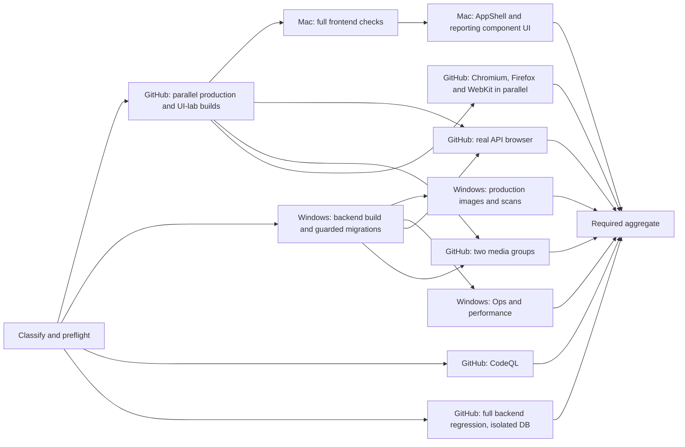

# CI scenarios, topology and validation

GitHub Actions coordinates all jobs. `merge gate / ready PR` is the stable required
check. Every selected check must succeed; missing, skipped, failed or cancelled
selected jobs never grant merge readiness. CI does not deploy production.

## Scenarios

Classification uses the complete Git diff against the PR base, including deletions,
moves and file modes. Titles and labels cannot weaken coverage. Mixed changes select
the union of applicable checks; unknown, schema, algorithm, authorization, dependency
and unscoped CI changes select the full platform route. Malformed classification fails closed.

- **Light content:** existing declarative instruments, norms and report content.
  Retain immutable/scientific/publication rules, declaration AST boundaries,
  all-Bundle closure, actual isolated-database import/scoring/report/FINAL and
  historical/revocation lifecycle checks. JS/TS declarations also select CodeQL.
  Executable behavior in a declaration must fail validation. Content compiled into
  a deployment unit still requires that unit's normal build and security scan.
- **Medium frontend:** ordinary UI functions without API, shared measurement,
  permission, persistence or database changes. Run frontend lint/types/audit/full
  regression/build, real API browser acceptance, the frontend image/scan and all
  affected UI/media acceptances. Content plus UI retains both sets of checks.
- **Standalone maintenance:** the exact allowlists under
  `server-version/scripts/attachment-backup/` and `server-version/scripts/host-ops/` select Node 24 deduplication,
  authenticated-index and cleanup-guard tests, host launcher/restore-volume guards,
  shell/systemd validation, and an isolated Docker launcher/failure-cleanup smoke.
  No backend dependency installation, database services, application build, visual
  browser or whole-platform CI is needed. Its coordinated routing tests and policy
  files may accompany these component changes; CI-only changes are not admitted by
  this shortcut. Draft and ready PRs both require actual maintenance job success.
  Unknown scripts, deletions/symlinks, dependency/application/DB/Compose changes and
  the existing restore workflow remain outside this allowlist. Forced-full still
  strengthens the route when explicitly selected.
- **Heavy platform:** full frontend/backend/mini, production images, all media,
  all three visual browser engines, performance, recovery and CodeQL checks.
- Ordinary engineering documentation has a narrow allowlist; scientific,
  publication and deployment documents retain their content/platform checks.

Management-UI content publication without a Git change uses application publication
validation. A server release is separate from WeChat mini-program publication.

## Current production routing: all self-hosted

The repository variable `CI_RUNNER_PROFILE` is `local`, and manual component/full
dispatch defaults to `local`. Hosted Actions minutes are exhausted. Keep subsequent
PR, main and diagnostic work self-hosted; do not select `speed` or `economy` without
an explicit decision to resume hosted usage. Windows/WSL `eduk12-win-ci` runs CodeQL,
backend/isolated database regression, production images/scans, recovery, performance
and actual API/media browser checks in its single exclusive slot. Mac runs routing,
frontend builds/regression, pure component UI and the three visual engines. Each
machine's existing resource preflight and exact-source artifact checks still apply.

The hosted speed topology below is retained as an optional capacity profile, not
the current default.

## Optional speed topology

Mac and Windows each retain one job slot. Performance checks run exclusively on
Windows and cannot overlap its image builds. Backend artifact production precedes
other Windows full-gate work so consumers can begin early. Browser consumers wait
for builds, not unrelated lint or frontend regression. The final aggregate waits
for both producers and every required validation.

Profiles are explicit:

| Profile | Hosted heavy work | Local work |
| --- | --- | --- |
| `speed` (recommended) | CodeQL, backend regression, main API browser, two media groups, production/UI-lab builds, three visual engines | Mac frontend/AppShell/component UI; Windows migrations/images/Ops/performance |
| `economy` | CodeQL, backend regression, main API browser | Mac frontend/all visual engines; Windows remaining real-service work |
| `local` (current default) | None | Mac frontend/UI, Windows real services and CodeQL |

Light/medium routes do not select heavy hosted acceleration. CodeQL runs on
Windows/WSL in local mode and on GitHub in hosted profiles. Broad medium UI changes can require all three browser engines
on Mac and take longer than a small medium change. `balanced`/`hybrid` are aliases
for `economy`. Self-hosted outages do not silently activate hosted fallback.

The initial planning target for a warm successful heavy `speed` run is 14–20 minutes
and approximately 48–66 hosted job-minutes. These are estimates, not measured guarantees or job
timeouts. Budget cold starts, isolated rollout probes and retries separately, and
check actual account usage before relying on an old remaining-minute figure.

## Build and scenario isolation

Build artifacts belong to this run and exact checked-out SHA. The manifest verifies
SHA, run ID, lockfile, build kind and content digest. Consumers fail closed on a
missing or mismatched artifact. No latest-success or cross-run fallback exists.
Ordinary production and UI-lab builds have distinct names and manifests. In heavy
`speed` runs, both production and UI-lab builds run in parallel on GitHub,
so compilation does not delay Mac checks or hosted browser consumers. Light and
medium builds remain local. The initial producer probe measured 44 seconds for
the hosted UI-lab job while the Mac production build took several minutes; final
run measurements remain authoritative. Native
`node_modules` are never transferred between Mac ARM and Linux x64.

Production images retain complete Dockerfile builds and HIGH/CRITICAL scans. Buildx
pulls base images and bypasses runtime-stage caches so OS security updates are not
hidden by a persistent application build cache.

Media scenarios share dependency/browser installation and compiled artifacts inside
two groups. Each scenario receives a freshly created `ptool` database and empty Redis
state inside the current Actions job's pinned disposable service containers. Reset
requires actual matching job service IDs, exact synthetic loopback URLs, test mode,
expected images and anonymous volumes. Foreign containers, bind mounts and named
persistent volumes are rejected. Ports must be free between scenarios. Existing
fixture guards, test assertions and individual evidence remain mandatory. Standalone
media workflows invoke the same composite scenario actions as grouped validation.

Local visual acceptance and the `ui` component probe use one matrix job per
Chromium/Firefox/WebKit engine. Chromium retains the single Mac slot; Firefox/WebKit use the exclusive
Windows/WSL slot because both engines failed before page startup in run 37762383022
(Mac sandbox/graphics initialization).
AppShell and QA round 3 run once in the Chromium job. Each engine retains the
20-minute timeout, complete scenarios, exact-run artifacts and cleanup. The
aggregate requires success from the whole matrix, and fail-fast is disabled so
one engine cannot suppress evidence from the others. The previous combined job
spent approximately ten minutes in Chromium alone in run 37755658225; combining
all engines and setup did not fit its unchanged 20-minute budget. This division
changes task scheduling, not assertions, scanner thresholds or runner capacity.
The standalone visual workflow accepts an explicit diagnostic engine (default all);
partial probes cannot substitute for the complete merge gate.

Pure UI uses a minimal lockfile-pinned Playwright runtime, without backend packages,
PostgreSQL, Redis or Docker on Mac. Hosted Chromium retains canonical/staff/classroom
screenshots, interaction and legacy-dialog checks; Firefox and WebKit retain their
complete interaction and legacy-dialog suites. AppShell remains explicitly gated on Mac. In speed mode all three visual engines run
on GitHub; economy and medium routes keep visual acceptance on Mac. The QA round 3 component browser flow runs on Mac
with its synthetic local APIs; real authorization and scoring remain covered by
the independent backend/database gates.

## Resource and cleanup policy

### Beijing production host: download and maintenance notes

The production server is in Beijing. Server maintenance, release builds and local
runner downloads must default to verified mainland mirrors or the existing
controlled acceleration path. Use the configured Tencent container registry
accelerator, `https://registry.npmmirror.com` for npm/native binaries, Tsinghua
`debian`/`debian-security` for Debian, and the verified
`https://mirrors.aliyun.com/alpine` source for Alpine security updates. The official
Alpine CDN was slow inside the release builder; the Tsinghua Alpine endpoint
returned HTTP 403 in that same container, while Aliyun served the signed index.

Keep package/base-image versions, lockfile integrity, official package signing
keys, TLS verification and HIGH/CRITICAL scan thresholds. Continue runtime security
updates before scanning the actual production image. A mirror change must not
skip upgrades or audits; use the official audit endpoint if a package mirror does
not implement auditing. If a mirror is unavailable or stale, record that evidence
before using a trusted official fallback. Verify the affected download/build and
original security scan before release; no unrelated full CI is needed for an
operator download setting. Preserve the immutable source checkout and record
operator recipe hashes, mirror URLs and actual image IDs in the release proof.

Mac uses the dedicated non-admin `eduk12ci` account and label `eduk12-mac-ci`.
Frontend uses the existing 3072 MiB Node heap and test worker limits. Routing requires
8 GiB disk headroom (5 GiB reserve plus a provisional 3 GiB working allowance), then
the job checks again. Adjust the allowance using measured peaks. UI checks release
preview processes and upload evidence before removing temporary outputs.

Each Mac job removes its frontend/backend/browser `node_modules` and build outputs.
Download caches are bounded: npm 512 MiB, Actions 256 MiB and tools 512 MiB,
with seven-day expiry. Browser installations use the job temporary directory and
are removed after each job; they do not accumulate a persistent browser cache. The existing hourly idle maintenance skips active
Runner.Worker processes, rotates service logs and removes expired CI temporary files.
Interrupted browser installations are covered by the existing idle temporary-file
expiry without modifying the protected maintenance service. Cleanup rejects symlinks and personal
accounts and never globally prunes Docker or retained data volumes.

Windows uses one exclusive `eduk12-win-ci` Linux/WSL runner. Heavy preflight requires
20 GiB free disk and 6 GiB effective memory across every visible cgroup ancestor.
Its validated clock guard remains required before runner startup. Tests use UTC;
host and production business timezones are unchanged. New concurrent heavy slots
require measured memory and separate ports, services and fixtures.

## Failure handling and rollout

Diagnose a failure, fix it, and run the affected component and necessary targeted
regressions with the same implementation/dependencies/parameters/isolation as the
formal gate. Do not use full CI as the first verification or relax timeouts,
assertions, authorization boundaries or scan thresholds to obtain a green result.

The existing CI workflow exposes `step_probe` values for frontend, backend,
backend-regression, targeted reporting, browser, media, UI, hosted Chromium UI, QA component UI, Ops, performance, images and Cognitive checks.
The `assessment-repair` probe runs the shared R5 regression selector, including
task-controller admission and collection snapshot completion fixtures, so the
focused gate catches filter-export and draft-before-publication contract drift.
It requires
non-skipping Questionnaire, Bundle, onboarding, SJT and anonymous-study PostgreSQL
evidence. With `runner_profile=local`, backend regression, browser, media, visual
and maintenance probes use self-hosted runners; there is no hosted fallback.
Probes invoke the formal reusable components and only their build prerequisites;
they disable normal classification/full jobs/CodeQL/merge readiness. Different probe
kinds have separate concurrency groups. A successful probe is not a full merge gate.

Regression jobs clear their exact temporary report paths before setup, so a
persistent self-hosted runner cannot upload a previous focus's test evidence.
Self-hosted regression uses its existing local npm download cache; remote npm
cache restore/save is limited to GitHub-hosted jobs. Lockfile installation, actual
tests, non-skipping assertions, artifacts and service cleanup are unchanged.

Keep integration work Draft during repair and probes. Freeze the combined functional
and CI head, verify every affected component, then run one final complete gate.
Same-source failed-job retries may preserve already successful jobs; changed source
or validation inputs require renewed relevant verification. Two independent PR green
results cannot prove their combined source. Main performs the normal post-merge
integrity smoke without duplicating an already validated complete source tree.

Standalone attachment timers can be enabled after the exact component head passes
maintenance CI and a bounded production check. This is separate from deploying the
application or database. Preserve `plan_only`, prior backup dependencies and
resource limits; automatic deletion is not part of the current component. A failed
unrelated application dependency audit does not redefine this host-only gate.
When the user pauses full CI, continue independent component validation without
starting full CI or presenting local results as a whole-platform pass.

The exact host-ops backup wrapper/config/installer/transport files additionally
select real encrypted DB backup/restore against a labelled disposable PostgreSQL
16 database and checksum-failure anonymous-volume cleanup. These wrappers reuse
the deployed backup/restore source unchanged and cannot restore production, write
the media bucket or delete cloud backups. They retain the maintenance route; old
backup/restore source edits, new unknown executors and application changes still
escalate. Local retention needs two verified cloud-backed restored copies; cloud
retention remains plan_only. Host backup installation is independent of deploying
the application and requires exact-head maintenance success plus bounded COS and
production verification.

External/untrusted PRs are blocked before any self-hosted checkout. CI accounts must
not read production SSH keys, environment files, encrypted-backup keys or personal
data. Required database suites retain non-skipping report assertions.

The explicit `server-version/scripts/cos-cleanup/` file allowlist adds the protected
version deletion component to maintenance. Unknown executors and mixed business,
database, dependencies or Compose paths remain outside this route. It adds historical
authenticated index scanning, retained DB/attachment reference closure, bounded
version deletion protocol, real encrypted filesystem transaction/checkpoint recovery,
host dual-writer locks and failed-task isolation checks. CI has no production COS
credentials; SDK tests are not evidence of live cloud deletion. A separately bounded
unique-prefix synthetic COS probe validates the same adapter's actual version deletion.
Production is plan-only until real joint recovery acceptance, independent deletion
identity and guarded backup writers are deployed; this is independent of application
deployment. Never trigger full acceptance to verify this component.

## CI trigger audit (2026-10-06)

Manual runs default to `full_acceptance=false`. Select a `step_probe` such as
`maintenance`, `cognitive`, `frontend` or `backend` for independent validation.
A manual request with no probe and no explicit full acceptance fails at the router,
before any platform jobs start. Automatic PR classification still uses the complete
Git diff. The router logs `platformReasons`, including each excluded path and file
mode/deletion escalation. The repository currently has no `CI_FORCE_FULL` override.

| Change | Selected checks | Escalation examples |
| --- | --- | --- |
| Versioned Scale instruments; existing Cognitive seeds/presentation/governance/scientific declarations; SJT instrument/publication/scientific JSON; exact Bundle content | Domain contracts, immutable/publication reviews, declaration boundaries, affected regression; all-Bundle dependency closure and isolated import/report/FINAL; TS declarations also select CodeQL on ready PRs | Scorers, task runners, authorization, shared contracts, Prisma, dependencies |
| Known attachment backup and observe-only host monitoring files/config/timers | Maintenance tests, Python guards, shell/systemd syntax, isolated Docker launch/failure cleanup, aggregate gate | New unknown maintenance executors, deletes/symlinks, business code/Compose/DB/dependencies |
| Existing database backup/restore scripts | Currently platform classification, with recovery rehearsal | These are outside the attachment component; a future dedicated recovery route needs equivalent isolated restore evidence before replacing this gate |

Additional causes of platform selection are a content/maintenance change mixed with
an unlisted file (including CI-only changes), content deletions/renames/mode changes,
and an explicit full request. For example Cognitive `task-package.json`,
`definitions.ts`, `semantics.ts` and `package.ts` currently stay outside the
declarative shortcut: they can change task admission, timing or runtime behavior.
The existing `scale/instruments/learning-motivation-wave1-data.json` is an exact
Scale exception: its existing instrument test validates reference data and report
behavior in the Scale lane. Other unlisted root-level data stays outside the
versioned instrument allowlist. A pure metadata exception must be verified against
its consumer and added with boundary tests, rather than widening a directory prefix.

Independent visual/media/Ops/performance workflows are reusable or manual; they do
not separately launch full CI for every PR. Situational publication has a separate
PR/review trigger, but checks its own relevant paths first and retains scientific
publication authority checks. It is a focused integrity check, not platform CI.

An unchanged architecture does not by itself prove a change has a small impact:
shared scoring, permissions, persistence and dependencies can affect many modules.
Use the actual impact and tested file boundaries to choose the gate. Ordinary
content and isolated maintenance do not need platform full acceptance.

## Dependency upgrade route

Version-only changes to existing npm dependencies, development dependency additions
and installed transitive overrides, paired with consistent npm v3 root locks, may
select dependencies CI. Existing backend/frontend test compatibility changes and
coordinated routing policy may accompany a dependency change. scripts, engines,
exports, build configuration, new production dependencies, removals, business code,
DB, Compose, Dockerfiles, unknown files and type/mode/deletion changes stay outside
this route. Unchanged manifests may accompany transitive lock refreshes.

Both draft and ready dependency PRs require maintenance routing/guard tests, backend
build/guarded migration/existing performance checks, isolated full backend regression,
frontend build/lint/typecheck/audit/full regression, production API/worker/frontend
image builds and the existing HIGH/CRITICAL scan, plus CodeQL. Every selected job
must succeed; missing/skipped/cancelled/failed jobs cannot authorize merge. No browser,
visual, media, mini-program or separate Ops acceptance is selected. Existing reusable
components, audit thresholds and image assertions are unchanged. Full requests still
strengthen selection. Main retains post-merge integrity smoke without repeating
component regression. Repeated ready events are unnecessary: publish the frozen head
and make it ready before the initial classification starts when local scoped checks
have already passed.

Production image CI passes the existing `DEBIAN_MIRROR` build argument for API and
worker to `mirrors.tuna.tsinghua.edu.cn`; Debian archive signatures and the existing
runtime refresh/security scans remain required. Frontend/npm sources are unchanged.
The exact two mirror argument/verification insertions in `ci-image-plan.mjs` and its
existing tests may accompany dependencies CI. The router compares the complete
executable file against the PR base after removing only those exact insertions;
other image-plan edits still select platform checks. Validate image-only first.
