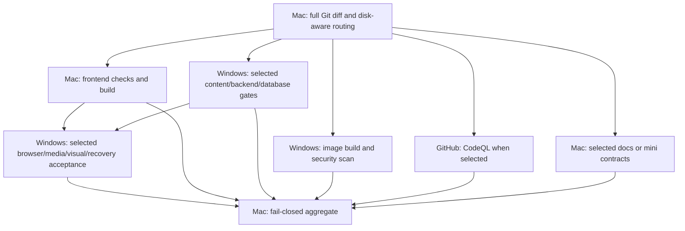

# CI runner and scenario policy

GitHub Actions coordinates every run. **merge gate / ready PR** remains the stable
required check. Every selected job must succeed; missing, skipped, failed or cancelled
required jobs never grant merge readiness. No CI workflow deploys production.

## Execution topology

Only CodeQL uses GitHub-hosted compute. Mac handles routing, documentation, frontend
lint/types/regression/build, mini contracts and the final aggregate. Windows Linux
handles content governance, backend, isolated databases, performance, production
images/scans, browser/media/visual and recovery acceptance.

Backend, image and CodeQL lanes depend on routing rather than frontend lint. Ready
frontend lint/types/full regression/build share one dependency installation. Cognitive
onboarding diagnostics run in the selected Windows backend build, reusing its dependencies. Drafts
retain the preparation-only frontend job. Browser consumers use this run's exact SHA
backend/frontend artifacts; no latest-success or cross-run fallback is permitted.
Application compilation is reused across browser consumers; production images retain
independent complete Docker builds and scans at the same source. Persistent Windows
image builds pull base images and bypass only runtime-stage caches via Buildx Bake,
so apt/apk security updates run again even when the pinned base digest is unchanged.
Dependency and application compilation caches remain reusable; HIGH/CRITICAL scans stay mandatory. Different UI-lab
build flags deliberately require that acceptance's own frontend build.

## Scenario selection

| Scenario | Mac | Windows | GitHub |
| --- | --- | --- | --- |
| Ordinary engineering docs | Diff whitespace and scope check, aggregate | None unless another changed path selects it | No CodeQL |
| Declaration-only content | Routing, any selected presentation checks | Existing immutable/scientific/publication rules, all-Bundle dependency closure, actual scoring/report/FINAL and guarded real-DB lifecycle | CodeQL for JS/TS declarations |
| Presentation CSS/design docs | Lint/types/production build | Selected visual/accessibility gates | No unrelated SAST |
| UI feature without measurement/backend changes | Lint/types/full frontend regression/build | Unchanged backend browser build, main real-API browser scenarios, frontend image/security/CSP, selected acceptance | CodeQL |
| Backend/algorithm/platform | Full relevant frontend and mini contracts | Backend build/migration/performance, full regression and selected browser/image/recovery gates | CodeQL |
| Schema/CI/dependencies/unknown mixed changes | Full consumers | Conservative platform route and selected migration/recovery/media/visual gates | CodeQL |

Ordinary docs are a narrow allowlist: root README/CONTRIBUTING, this policy and
engineering documentation under docs/development or docs/contributing. Scientific,
publication and release/runbook documents retain their content or platform route.
Content plus UI requires the union of both routes.

The router reads the complete NUL-delimited raw Git diff. It fetches the exact base
commit shallowly when missing instead of fetching all history. Deletes, moves,
symlinks and executable/type changes conservatively select platform. Unknown profiles
or malformed output fail closed. Scientific engines, scorers, measurement timing,
API contracts, persistence, shared configuration and schema cannot use the UI route.
Scope is based on reviewed versioned paths/dependencies, not PR titles or labels;
new measurement logic needs platform validation even when introduced in a page file.
force-full can strengthen but never weaken coverage.

Content validation retains its existing declaration AST boundary and all-Bundle
closure. A content-looking path with executable behavior must fail validation;
it cannot publish. Changes through the application's management UI without a Git
change use business publication validation rather than a source build. Content
compiled into a backend release still requires its normal deployment unit and scans.
CI and CD remain separate under server-version/DEPLOYMENT-CHECKLIST.md.

## Capacity and disk policy

The default profile is local. Legacy balanced/hybrid values select this same local
policy; hosted override is rejected. Mac availability is enabled with the existing
CI_MAC_LIGHT_ENABLED variable. Routing and aggregate use Mac when enabled, otherwise
Windows. Offline self-hosted runners do not trigger hosted fallback.

Windows has one runner with the exclusive eduk12-win-ci label. Do not label multiple
runners sharing Docker, ports or mutable paths. Every DB job has its own PostgreSQL/
Redis services and guarded migrations. Heavy preflight requires Linux, at least
20 GiB free disk and 6 GiB effective memory after every visible cgroup ancestor limit.
Occupied application ports fail without killing unrelated processes. Future heavy
parallelism requires measured memory capacity and separate ports/databases/fixtures.

Mac uses the dedicated non-admin eduk12ci account and eduk12-mac-ci label, with one
job slot. Its memory can run full frontend checks. Frontend jobs use a 3072 MiB Node
heap setting and the existing two-worker frontend test limit. Frontend test processes
use UTC for parity with the former Linux CI; host and production business timezones
are unchanged. Routing requires at
least 8 GiB free disk before choosing Mac frontend (5 GiB reserve plus a provisional
3 GiB working allowance); otherwise both frontend preparation and full build route
to Windows. Frontend preflight verifies capacity again before dependency installation.
Control jobs require only 1 GiB disk and 512 MiB memory; Mac light/mini jobs require
5 GiB disk. The frontend working allowance must be adjusted from measured peaks.

Mac post-job cleanup removes only the dedicated checkout's frontend/backend
node_modules and dist after artifacts are uploaded. npm cache is capped at 512 MiB,
Actions cache at 256 MiB, tool cache at 512 MiB, all with seven-day expiry. Hourly
launchd maintenance skips active Runner.Worker processes, clears expired temp/diagnostic
files and rotates bounded service logs. Symlink roots/parents and personal accounts
are rejected. Credentials/current runner binaries and personal files are preserved.
Docker images/browser binaries are kept on Windows, where disk has more capacity;
there is no global Docker pruning or deletion of retained user data volumes.

## Acceptance and security

Versioned acceptance-scopes.json chooses reusable media/browser/visual/PERF/ops gates
inside the main aggregate. Ordinary PRs select only affected gates. CI changes are
conservative and select the widest affected set during rollout. Manual full_acceptance
(default true) explicitly executes all reusable acceptances for exact-commit validation.
Standalone debug/performance workflows use Windows; they never consume hosted compute.
Before full rollout, dispatch the existing CI entry with step_probe=images
(frontend-only and complete image modes) or step_probe=cognitive / step_probe=frontend. The frontend probe calls the same
reusable workflow as full CI, including lint, types, dependency audit, all frontend
tests, production build, exact-commit artifact upload and Mac cleanup. Routing, full jobs,
CodeQL and the normal aggregate are disabled for these component probes. Main image CI calls that same reusable workflow;
Cognitive probes execute the same shared diagnostic script and include its frontend suites.
Targeted failures must be repaired and revalidated before another full run.

External PRs are blocked in job.if before any self-hosted checkout and again by the
router. Publication and aggregate also apply that admission guard. Public/untrusted
contributions require a separate reviewed isolated workflow. Personal production SSH
keys and environment files must not be accessible to a CI account or printed in logs.

## Budget and validation

Hosted compute is now the selected CodeQL job alone. Successful historical CodeQL
median was 7.27 minutes; reserve approximately ten minutes per Ready source validation,
then replace this estimate with measured billing usage. Ordinary docs, JSON content
and Draft preparation need no hosted execution. Artifacts/cache storage is accounted
separately. These are planning estimates, not job timeouts or billing guarantees.

For a hypothetical 500-minute remaining allowance, provision 400 minutes for forty
CodeQL runs, 60 for retries and 40 for other account/release needs. Confirm actual
remaining allowance and shared repository usage before treating this mix as capacity.

First validate synthetic actual-Git diffs and fail-closed aggregate across every
scenario, all workflow syntax and cleanup safeguards. Then run this exact commit's
Draft checks and one manual full acceptance. Record runner assignment, test counts,
non-skipping assertions, execution/dependency waits, memory and disk peaks and cleanup.
Do not merge or claim full rollout success while necessary gates are pending/failed.

## Dated environment evidence (2026-10-05)

Windows runner 25 has an 8 GiB service limit and 8 GiB WSL cap with memory reclaim.
Its CI Docker proxy passed complete APT installation and HTTPS verification; formal
production image results still require the new run. Mac runner 28 starts with launchd;
idle maintenance passed and the dedicated account could not read the personal
production SSH key. Previous cancelled Mac trial passed npm install/lint and post-job
cleanup; typecheck/full regression/build are not claimed passed from that trial.

SJT authoring's CI DB guard now verifies Actions/test context, the current job's exact
64-character PostgreSQL container ID, the reserved synthetic loopback URL and equality
to DATABASE_URL; it supports both self-hosted and hosted without spoofing context.
MEDIA-7 uses its own explicit isolated published fixture, not a mutable DRAFT seed.
These observations are dated; query actual service state before relying on them.

Billing reference: [GitHub Actions billing](https://docs.github.com/en/billing/concepts/product-billing/github-actions).
