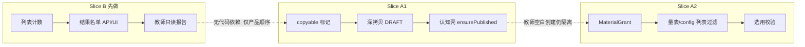
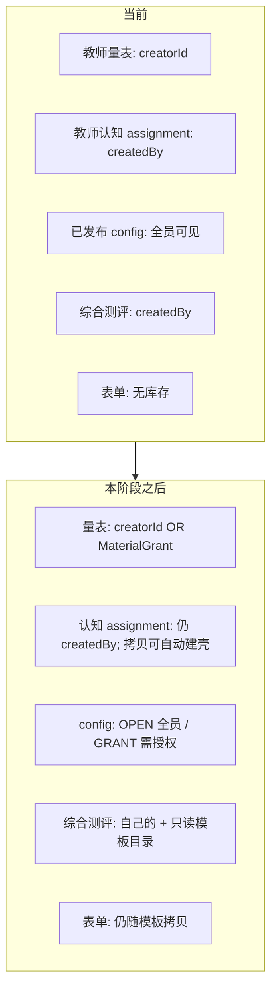
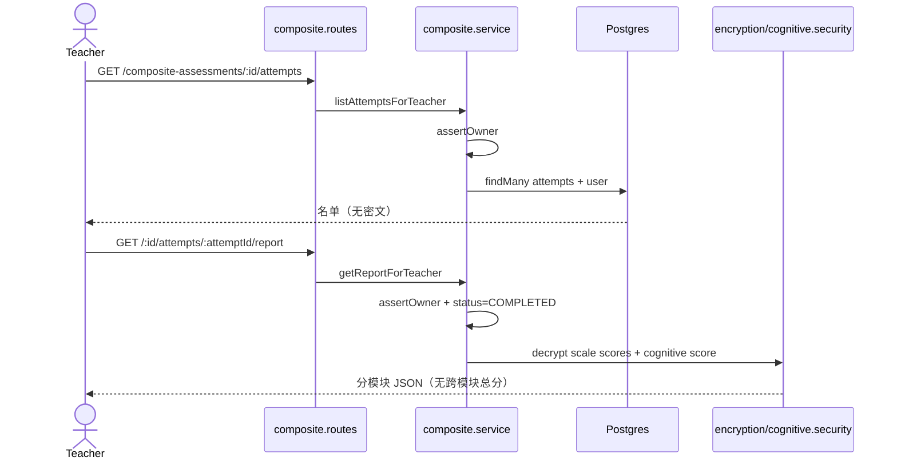
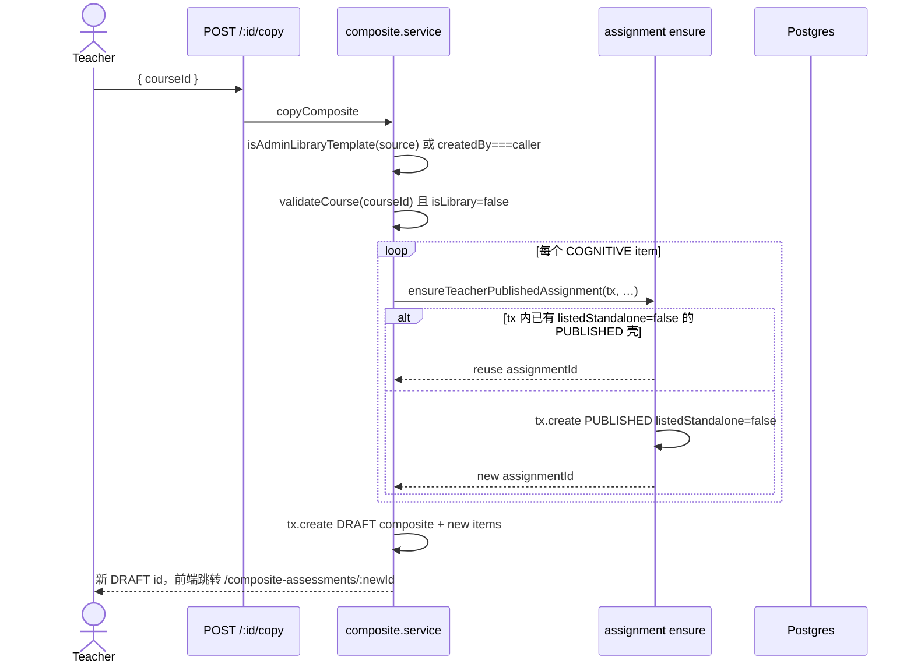
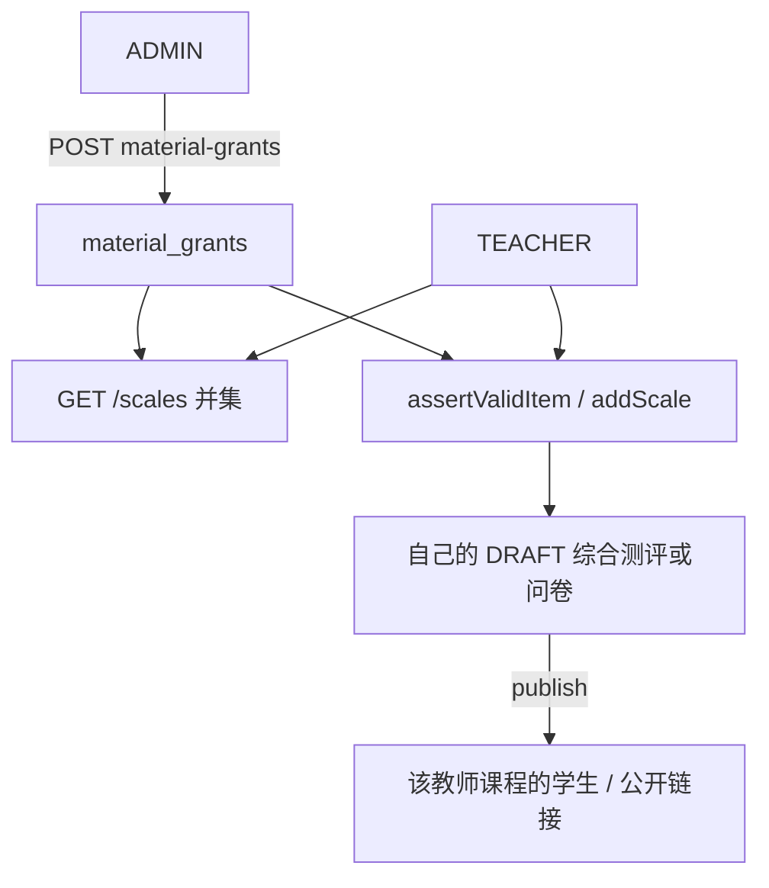

# eduK12 下一阶段设计：综合测评教师结果 + 管理员库与教师复用

| 字段 | 值 |
|---|---|
| **文档标题** | Composite Teacher Results & Admin Library Reuse |
| **作者** | TBD（实现前评审） |
| **日期** | 2026-08-22 |
| **状态** | Approved（产品已拍板；库课程修订：一类管理员特有权限，可建多门） |
| **产品** | eduK12 / PTool / 慧育空间 |
| **仓库** | `/Users/Qiang/Documents/eduK12-dev` |
| **基线标签** | `checkpoint-2026-08-22-followups` |
| **建议实现分支基底** | 先把 `fix/composite-create-ux` 合入 `dev`（其上已有综合测评创建/公开链接 UX 修补与两份延期文档），再从 `dev` 开本阶段分支。**不要**以 `origin/refactor/cognitive-phase1-phase2-optimization` 为基底。 |
| **代码布局** | `server-version/{backend,frontend}`（保持，不提升到仓库根） |
| **延期来源** | `docs/deferred-composite-teacher-results.md`、`docs/deferred-admin-library-reuse.md` |

产品已拍板。实现按文末 PR Plan：先把 `fix/composite-create-ux` 合入 `dev`，再从 `dev` 开 PR 1。两条切片必须都进入 PR 计划，但按推荐顺序独立可交付。

**库课程修订（相对讨论稿）：** `Course.isLibrary` 是一类管理员特有课程权限，**可建多门**，不是全站唯一一门。教师课程不能标 `isLibrary`。标为 true 时仍强制 `isRecruiting=false`。不再因「已有另一门库课」返回 409。

---

## Overview

当前课堂试用卡在两处，而不是引擎或计分：

1. **教师看不见综合测评作答情况。** `listComposites` 已经带 `_count.attempts`（全部状态合计），但 `CompositeAssessmentList.tsx` 不展示；配置页只有导出按钮。学生/匿名个人报告已存在，教师没有名单、没有点进只读报告的入口。公开链接卡片上的「已使用 N 次」是 `CompositeAssessmentAccessToken.usedCount`（入口占用），不是完成人数。
2. **教师只能用自己创建的材料拼综合测评。** 量表 `GET /api/scales`、认知任务 `GET /api/cognitive/assignments`、综合测评 `listComposites` 均按 `creatorId` / `createdBy` 隔离。管理员可以预编一份「量表 + 表单 + 认知」综合测评，但没有「复制成教师自己的 DRAFT」产品路径，也没有「把某份已发布量表/任务类型授权给某教师」的授权表。

本阶段拆成两个**独立可上线**切片：

- **Slice B（先做）— 教师综合测评结果：** 列表展示已开始/已完成人数；新路由 `/composite-assessments/:id/results` 给出作答名单；点进与学生报告同结构的只读报告。导出仍是群体数据主路径。
- **Slice A（后做）— 管理员库 + 教师复用：** A1 管理员把已发布综合测评标为可复制模板，教师深拷贝成自己的 DRAFT 并换绑课程；A2 管理员把**特定已发布量表**和**特定已发布 CognitiveTestConfig** 授权给**特定教师**。表单不做独立库存。

两条切片共享「综合测评是编排容器、不算跨模块总分」这一既有规格，但**没有代码依赖**：B 只读已有 `CompositeAssessmentAttempt`；A 不依赖结果页。推荐 B → A1 → A2，是因为课堂试用已经被「交了卷却看不见人」挡住，而管理员库在管理员本人代编/代发的前提下仍可人工绕过。

---

## Background & Motivation

### 当前停点

- 框架与缺口修补见 `docs/checkpoint-2026-08-22.md` 与 `docs/checkpoint-2026-08-22-followups.md`。
- 工作树目前在 `fix/composite-create-ux`（相对 `dev` 还有创建综合测评课程下拉、公开链接有效期等 UX 修复，以及两份延期文档）。
- 认知模块运行时以 `GET /api/capabilities` → `{ cognitive: boolean }` 为准，后端开关 `COGNITIVE_MODULE_ENABLED`。
- GitHub Actions 因账单不可用。验收以本地 `vitest` 为准。

### Slice B：教师侧「交了卷却看不见」

| 角色 | 页面 | 现状 |
|---|---|---|
| 学生 | `/student/composite/attempts/:id/report` | 分模块个人报告，无跨模块总分 |
| 匿名 | `/public/composite/attempts/:id/report` | 同上，靠 `X-Recovery-Token` |
| 教师 | `/composite-assessments/:id` | 模板配置 +「导出摘要 / 导出完整数据」 |
| 教师 | 无 | 无名单、无进行中/已完成、无点进报告 |

存储（已存在，本阶段不改语义）：

- 一次作答 = `CompositeAssessmentAttempt`（`IN_PROGRESS` / `COMPLETED` / `ABANDONED`）。代码里目前**没有写入 ABANDONED** 的路径，计数仍按三态设计。
- 表单：`CompositeFormAnswer` 明文。
- 量表：子表 `Assessment`，完成后 `answers` / `scores` / `feedback` 加密。
- 认知：子表 `CognitiveSession` + `CognitiveTrial`，试次与得分加密。
- **没有**综合测评总分字段；`getReport` 明确分模块返回。本阶段继续不做跨模块总分。

`listComposites`（`composite.service.ts`）已：

```200:241:server-version/backend/src/modules/composite/composite.service.ts
export const listComposites = async (userId: string, role: UserRole) => {
  // ...
  const list = await prisma.compositeAssessment.findMany({
    where,
    // ...
    include: {
      // ...
      _count: { select: { attempts: true, accessTokens: true } },
    },
  })
```

前端列表只用了 `name` / `code` / `itemCount` / `status` / `course`，忽略 `_count.attempts`。且该计数含进行中，无法区分完成。

教师报告不能复用学生路由：`GET /api/composite-assessments/attempts/:attemptId/report` 挂 `requireRole(STUDENT)`，`findAttempt` 校验 `attempt.userId === context.userId`（或匿名恢复哈希）。教师走这条会 403。必须新增教师鉴权的 GET。

### Slice A：隔离是设计，不是 bug

教师只能用自己的材料：

| 材料 | 列表过滤 | 选用校验 |
|---|---|---|
| 量表 | `scaleController.list`：`TEACHER` → `where.creatorId = userId` | `assertValidItem`：非 ADMIN 且 `scale.creatorId !== userId` → 403 |
| 认知任务实例 | `listTeacherAssignments`：`TEACHER` → `where.createdBy = userId` | `assertValidItem`：非 ADMIN 且 `assignment.createdBy !== userId` → 403 |
| 认知任务类型 | `GET /api/cognitive/configs` → **全部 PUBLISHED 配置对所有教师可见**（无 `creatorId` 字段，由 seed 写入） | `createAssignment` 只要求 config `PUBLISHED` + Registry 可解析 |
| 表单 | 无独立表 | 写在 `CompositeAssessmentItem` / 问卷 `formItems` |
| 综合测评 | `listComposites`：`TEACHER` → `createdBy = userId`；ADMIN 看全站 | `assertOwner` |

管理员已能在同一套 `CompositeAssessmentEdit` 里预编模板（ADMIN 绕过量表/任务归属），但教师既看不见这些模板，也不能复制。问卷产品已有 `POST /api/questionnaires/:id/duplicate`、`POST /api/general-questionnaires/:id/duplicate`、课程 `POST /api/courses/:id/clone`。综合测评没有对应物。产品上「问卷」在本需求里**只指综合测评容器**，不是 `/questionnaires` 聚合问卷，不要做同一个「复用」按钮。

### 硬约束（本阶段不得打开）

- 不合入 `origin/refactor/cognitive-phase1-phase2-optimization`（无 ParticipantIdentity 整表替换、无 ScoringEngineRegistry、无 cursor 分页、无会改变可解释语义的统一 quality-rules）。
- 公开综合测评路由保持**无登录**（`app.use('/api/public/composite-assessments', …)`，`composite.public.routes.ts` 无 `authenticate`）。课堂互动码继续 `optionalAuthenticate`（`routes/classrooms.ts`）。两套入口不要混写。教师结果 API 一律要教师 JWT。
- 量表档位保持连续 1..N，教师只改标签（`scaleLabels.ts` / `normalizeScaleConfig`）。
- JWT 账号状态已在 `authenticate` 查 `isActive` / `isFrozen` / `expiresAt` / `teacherApproved`；不重开。
- 本地优先 git；功能开关用环境变量 / 角色，不用 GitHub Actions。
- `CognitiveTestConfig` 一旦 `PUBLISHED` 不可原地改核心字段（`config-immutability.ts` + seed「存在但内容不同则 FAIL」）。不发明评分 JSON 编辑器。
- 教师冻结/审核已存在，授权只授给 `role=TEACHER && teacherApproved && isActive && !isFrozen`。
- 教师导出默认匿名（`composite.controller.ts`：`anonymize = role === ADMIN ? input.anonymize : true`）。结果页是课内监控，不是导出。

---

## Goals & Non-Goals

### Goals

**Slice B**

1. 教师列表与配置页展示 **已开始人数** 与 **已完成人数**（可另给进行中）。
2. 教师结果页：作答名单、状态、进度、完成时间。登录学生**主列 nickname、副列 username**（nickname 空则主列仍空、副列 username，不要合成一格）。匿名主列 `anonymousCode`（`ANON-` + 8 hex），无副列。删除用户主列「已删除用户」，无 username 副列，不标匿名。ADMIN 可看任何教师的结果页（与全站 list/export 一致）。
3. 已完成记录可点进只读报告，模块结构与 `getReport` / `CompositeReportPage` 相同（量表维度+反馈 / 认知得分+指标+质量 / 表单原文）。
4. 导出路径保持不变，仍是群体与逐题/逐试次主路径。

**Slice A**

1. **A1：** 仅绑在 **库课程**（`Course.isLibrary=true`）上、由 ADMIN 创建并已发布的综合测评可标 `copyable`；教师复制为**自己的 DRAFT**，必须换绑自己的授课课程（丢弃源 courseId）；表单字段深拷贝；量表 **引用同一 `scaleId`**；认知按 **config id** 映射到教师自己课程上的 **wrapper**。
2. **A2：** 管理员把特定已发布量表、特定已发布 `CognitiveTestConfig` 授给特定教师。seed 四套 config 保持 `OPEN`。授权后教师可在综合测评 / 问卷里**选用**，但不能编辑他人量表。撤销授权只拦新添加，不扫描教师 DRAFT、不改已发布容器。
3. 表单继续寄生在模板上，不新建表单库。

### Non-Goals

- 跨模块综合总分、常模对照图、班级统计图（结果页顶部的已开始/已完成数字不算「图表」）。
- 认知 config JSON 在线编辑器、新 `configVersion` 发布工作流、ScoringEngineRegistry。
- 把教师列表改成默认看全站材料。
- 共享**同一个** `CognitiveAssignment` 或**同一个** `CompositeAssessment` 给多个课程（学生数据会串）。
- 聚合问卷（COURSE）与综合测评混用一个复用按钮。
- 微信小程序认知/综合测评。
- ParticipantIdentity、cursor 分页、导出格式变更、公开问卷 POW。
- 授权给 STUDENT；授权 DRAFT 量表；教师之间互授。
- 收回授权后自动拆掉已发布综合测评里的模块。

---

## Key Decisions

1. **切片顺序：B → A1 → A2。** B 的数据与报告 builder 已存在，不阻塞课堂看人数；A1 不依赖结果页；A2 需要授权表且会改多处列表过滤，风险最高、紧迫度最低（延期文档写明「稍后，不急」）。两切片都进本阶段 PR 计划。**ADMIN 可查看并点进其他教师综合测评的结果**（`assertOwner` 对 ADMIN 直接 return，与今天 `listComposites` `where={}`、全站导出一致）。测试：ADMIN GET 另一教师的 `/composite-assessments/:id/attempts` 与 report → 200；教师互访 → 403。
2. **授权对象：已发布量表 + 已发布 CognitiveTestConfig（任务类型），不是 CognitiveAssignment 实例。** 手动创建的课内作业仍按 D3：DRAFT → 教师可改 title / instruction / maxAttempts / courseId → publish。拷贝产生的 **wrapper** 是另一类 assignment（见 KD5），不能用「教师随便改壳」来描述。
3. **seed 四套认知 config 保持 OPEN（已拍板）。** fake / reaction / memory / stroop 对所有已审教师仍可 `createAssignment`。A2 的 `accessPolicy: OPEN | GRANT` 仍落地，管理员可事后把某 config 改为 GRANT。copyable 模板不依赖这条（模板内 configId 在 copy 时一次性放行）。
4. **模板复用：深拷贝成教师 DRAFT，不是共享 live 引用。** 已发布综合测评的 items 本就不可改（`assertDraft`）。拷贝时快照 items；之后管理员再发 v2 不影响已拷贝 DRAFT。`copiedFromId` 只作来源审计，不作运行绑定。
5. **拷贝产生的认知壳是受限 assignment 类（wrapper），不是「列表隐藏」化妆品。** 自动创建 `status=PUBLISHED`、`listedStandalone=false` 的包装（理由同前：`publishComposite` 已要求 PUBLISHED assignment，不把教师赶回认知任务页）。`listedStandalone=false` **必须**在下列入口拒绝，而不是只过滤 `listStudentAssignments`：学生 GET-by-id、`POST /sessions`、`POST /sessions/:id/restart`、公开 token 创建/start、教师认知导出、学生 history（`compositeAttemptId: null`）。教师仍能在自己的 assignment 列表里看到徽章「综合测评用」，并可把该壳再挂到自己的另一份综合测评上（复用）。Wrapper 在 ensure 之后 **不可改 course / config / maxAttempts / required / listedStandalone**；允许窄 PATCH `title` / `instruction`。仍被非 ARCHIVED 综合测评 item 引用时禁止 archive。
6. **拷贝时量表：引用原 `scaleId`，不克隆 Scale。** 可复制模板是对**模板上已有** `scaleId` / `configId` 的一次性实例化许可（与量表 bypass 对齐）：copy 事务内不要求调用者持有 MaterialGrant，也不要求 `canInstantiateConfig`。这些 id **仍不出现**在空白综合测评/问卷选择器里，直到 A2 显式授权。教师若从已拷贝 DRAFT 删掉该模块，再手动添加走 `assertValidItem` / `addScale`（A2 之前会 403）。
7. **结果页新教师 API，不复用学生/匿名 report 路由。** 新 `GET /api/composite-assessments/:id/attempts` 与 `GET /api/composite-assessments/:id/attempts/:attemptId/report`。鉴权：`authenticate + requireTeacher` + `assertOwner(composite)`。`getReport` 抽成与身份无关的 `buildCompositeReport`（共享给学生路径，含单模块解密降级），教师入口不传学生 `userId`、不用恢复凭证。
8. **结果页只读已完成报告；进行中只显示名单行。** `getReport` 已拒绝非 `COMPLETED`。不在本阶段给教师看进行中明文表单/量表草稿。
9. **名单不分页策略：沿用现有 offset 分页，不用 cursor。** `getPaginationParams` 默认 pageSize 20、上限 100。课堂量级（数十人、偶发过百）可接受。索引已有 `@@index([compositeAssessmentId, status])`。
10. **功能开关：B 只靠角色；A2 增加 `MATERIAL_GRANTS_ENABLED`。** 必须同时写入 `rawConfig` 与 Zod `configSchema`（`parseBooleanEnv('MATERIAL_GRANTS_ENABLED', true)`）。默认 `true` 与 `COGNITIVE_MODULE_ENABLED` 默认 `false` 不同：grant 表为空时行为等于今天的 creatorId 隔离，打开开关不会突然暴露材料；认知开关关着才能保护未配密钥的旧部署。A1 不另开总开关。
11. **库模板谓词（三处同一函数）已拍板：必须绑库课程。**  
    `isAdminLibraryTemplate` = `copyable && status==='PUBLISHED' && creator.role===ADMIN && courseId != null && course.isLibrary===true`。  
    仅 ADMIN 可 PATCH `copyable`；教师创建的行 → 403；DRAFT → 400；源课程不是库课程 → 400。`GET /library` 与非自复制 `POST /:id/copy` 用同一谓词。A1 起 list/detail 返回 `copyable`、`createdBy`、`creator: { id, role }`、`course: { id, title, isLibrary }`、`canSetCopyable`（当前用户 ADMIN ∧ creator.role=ADMIN ∧ status=PUBLISHED ∧ course.isLibrary）。自复制仍是 `createdBy === 调用者`，不要求源是库课程。库课程识别用 **`Course.isLibrary`（默认 false）**，不用 env `LIBRARY_COURSE_ID`（免发版改 ID）。**库课程是一类管理员特有课程权限，可建多门**（不设全站一门上限，不加 unique）。教师课程不能标 `isLibrary`。
12. **「问卷」= 综合测评容器。** 导航已分开：「聚合问卷」`/questionnaires`、「泛化问卷」`/general-questionnaires`、「综合测评」`/composite-assessments`。复用入口只出现在综合测评列表。
13. **同一教师同一课同一 config 复用一个 wrapper。** `@@unique([assignmentId, participantKey, attemptNo])` 因 `createCognitiveChild` 把 `attempt.id`/`item.id` 编进 `participantKey` 而不撞号。认知导出按 `assignmentId` 聚合、无 `compositeAttemptId` 维，因此 **wrapper 上禁用认知导出和公开认知链接**；教师看群体数据走综合测评导出。并发拷贝可能插入两个 wrapper（无 `(createdBy, courseId, configId, listedStandalone)` unique），可接受，ensure 优先复用已有 `listedStandalone=false` 行。
14. **`canUseScale`：自己的任意状态；否则必须 grant 且 PUBLISHED。** ADMIN → true。`creatorId === userId` → true（含 DRAFT，保持问卷 `addScale` 今天能挂自己的草稿量表）。他人量表 → 存在 SCALE grant **且** `status=PUBLISHED`。综合测评 `assertValidItem` 另保留「必须 PUBLISHED」——教师不能把未发布量表塞进综合测评。A2 关闭问卷/泛化问卷 `addScale` 只查问卷归属的既有漏洞。
15. **撤销量表授权不拆 DRAFT（已拍板）。** 只拦新的 `addItem` / `addScale`。已发布综合测评/问卷不动；教师草稿里已挂上的 scaleId 不自动移除。
16. **结果名单登录学生两列展示（已拍板）。** 主列 `nickname`（可空），副列 `username`。匿名：主列 `anonymousCode`，无副列。删除用户：主列「已删除用户」，无副列，`isAnonymous=false`。禁止再合成 `nickname || username` 一格。

---

## Proposed Design

### 阶段关系



### 总览：材料可见性



---

### Slice B — 教师综合测评结果

#### B.1 列表计数

改 `listComposites`：对**本次 `findMany` 返回的全部 id**做一次 `groupBy`。`listComposites` **今天不分页**（教师 `createdBy=userId`，ADMIN `where={}` 全站）。不要按「当前页」理解，也不要借此给列表加上 cursor/offset。`ids.length === 0` 时跳过 `groupBy`（Prisma `in: []` 可能直接报错）。ADMIN 路径是 O(全站综合测评 × 作答状态)；当前课堂体量可接受，量上来再拆，本阶段不加 Redis。

```ts
const ids = supportedList.map((item) => item.id)
const grouped = ids.length === 0
  ? []
  : await prisma.compositeAssessmentAttempt.groupBy({
      by: ['compositeAssessmentId', 'status'],
      where: { compositeAssessmentId: { in: ids } },
      _count: { _all: true },
    })
```

映射到每个模板，并 **停止把 Prisma `_count` 展开进 JSON**（今日 mapper `...item` 会带上 `_count.attempts` 全状态合计，前端曾忽略它；同时返回 `_count` 与 `attemptCounts` 会再次绑错字段）：

```ts
{
  attemptCounts: {
    started: number    // IN_PROGRESS + COMPLETED + ABANDONED
    inProgress: number
    completed: number
    abandoned: number
  }
}
```

不要把 `accessTokens.usedCount` 当成完成人数。前端文案必须区分：

- 列表卡片：「已开始 N · 已完成 M」（只读 `attemptCounts`）
- 公开链接卡片：继续「链接已使用 N 次」（token `usedCount`）

配置页 `getCompositeForTeacher` 同样返回 `attemptCounts`、同样不返回 `_count`，避免列表/详情数字不一致。A1 起 list/detail 还要带上 `copyable` / `createdBy` / `creator` / `course.isLibrary` / `canSetCopyable`（见 A.1 API，不要让 PR 4 去猜）。

**负载：** 教师名下模板数量通常个位数到几十；每次列表多一次 groupBy，走现有 `(compositeAssessmentId, status)` 索引。

#### B.2 结果名单 API

**新路由**（挂在 `composite.routes.ts`，教师段，`/:id` 已存在，子路径可后注册）：

```
GET  /api/composite-assessments/:id/attempts
GET  /api/composite-assessments/:id/attempts/:attemptId/report
```

查询参数（名单）：

| 参数 | 规则 |
|---|---|
| `status` | 可选 `IN_PROGRESS` \| `COMPLETED` \| `ABANDONED` |
| `q` | 可选，匹配 `anonymousCode` / `user.nickname` / `user.username`（`contains`，课堂量级可接受） |
| `page` / `pageSize` | `getPaginationParams`：默认 20，上限 100 |

排序：`completedAt desc nulls last`，其次 `startedAt desc`。

响应：

```ts
{
  assessment: { id, name, code, status, courseId },
  attemptCounts: { started, inProgress, completed, abandoned },
  list: Array<{
    id: string
    status: 'IN_PROGRESS' | 'COMPLETED' | 'ABANDONED'
    progress: number
    completedItems: number
    startedAt: string
    lastSavedAt: string
    completedAt: string | null
    totalTime: number | null
    isAnonymous: boolean         // Boolean(anonymousCode)；删除登录用户后仍为 false
    anonymousCode: string | null
    nickname: string | null      // 登录学生主列；匿名/删除为 null
    username: string | null      // 登录学生副列；匿名/删除为 null
    displayName: string          // 主列便捷字段，规则见下
    userId: string | null        // 供排查，UI 默认不展示；用户删除后因 onDelete:SetNull 为 null
  }>
  page: number
  pageSize: number
  total: number
  totalPages: number
  hasMore: boolean
}
```

**禁止返回：** `recoveryTokenHash`、恢复凭证明文、量表/认知密文、表单全文（名单不是报告）。

实现：`listAttemptsForTeacher(userId, role, compositeId, query)` 内 `assertTeacher` + `loadComposite` + `assertOwner`，再 `findMany` + `count`。`include: { user: { select: { id, nickname, username } } }`。

`CompositeAssessmentAttempt.user` 为 `onDelete: SetNull`。展示规则（已拍板，禁止 `nickname || username` 合成一格）：

```
isAnonymous = Boolean(attempt.anonymousCode)

匿名：
  nickname = null, username = null, displayName = anonymousCode   // ANON- + 8 hex

登录且 user 仍在：
  nickname = user.nickname        // 可空，主列允许空白
  username = user.username        // 副列必有（User.username unique 非空）
  displayName = user.nickname     // 主列只放 nickname，不要回落到 username

登录用户已删除（userId SetNull、无 anonymousCode）：
  nickname = null, username = null
  displayName = '已删除用户'
  isAnonymous = false
```

前端主列渲染 `displayName`，副列仅当 `username != null` 时显示。`q` 仍匹配 anonymousCode / nickname / username。

#### B.3 教师只读报告

抽 `buildCompositeReport(attempt)`，从现有 `getReport` 拆出模块拼装（量表 `safeDecrypt` scores/feedback、认知 `decryptCognitivePayload` score/metrics/qualityFlags、表单明文、`resolveCognitiveReference`）。学生/匿名路径继续走 `findAttempt` 的身份校验，但拼装走**同一** builder。

量表 `decodeJson` → `safeDecrypt` 失败已返回 `null`。认知 `decryptCognitivePayload`（`cognitive.security.ts`）对坏信封 **throw**；学生 `getReport` 今天可能因一个坏模块 500。history 已 skip 坏密文（`history.service.ts:66-71`）。`buildCompositeReport` 必须对每个模块 try/catch：失败则该模块 `{ decryptError: true, scores/score/metrics/qualityFlags: omitted }`，HTTP 仍 200，日志 `logger.warn` 只带 attemptId/itemId/type，**不带密文**。教师和学生/匿名报告同一降级。

教师路径：

```ts
export const getReportForTeacher = async (userId: string, role: UserRole, compositeId: string, attemptId: string) => {
  assertTeacher(role)
  const composite = await loadComposite(compositeId)
  assertOwner(composite, userId, role)
  const attempt = await loadAttemptWithChildren(attemptId) // 不含身份校验
  if (attempt.compositeAssessmentId !== compositeId) throw compositeNotFound('综合测评记录不存在')
  if (attempt.status !== 'COMPLETED') throw compositeBadRequest('综合测评尚未完成')
  return buildCompositeReport(attempt)
}
```

**不要**让教师调用 `GET /attempts/:attemptId/report`（学生）或公开报告。避免：

- 用教师 JWT 撞上 `requireRole(STUDENT)`；
- 误把 `findAttempt` 改成「教师也可凭 userId 看任意 attempt」（IDOR）。

响应 JSON 与学生报告同形（`CompositeReport`，模块可多 `decryptError?: boolean`）。前端复用 `CompositeReportPage` 时必须按路径分模式，禁止教师 URL 仍打学生 API：

- 学生：`/student/composite/attempts/:attemptId/report` + `StudentProtectedRoute` + `compositeApi.report(attemptId)` → `GET /api/composite-assessments/attempts/:attemptId/report`
- 公开：`/public/composite/attempts/:attemptId/report` + 无登录 + `X-Recovery-Token`
- 教师：`/composite-assessments/:id/attempts/:attemptId/report` + `ProtectedRoute roles={['TEACHER','ADMIN']}` + **同时**读 `id` 与 `attemptId` + `compositeApi.teacherReport(id, attemptId)` → `GET /api/composite-assessments/:id/attempts/:attemptId/report`；返回按钮去 `/composite-assessments/:id/results`

学生 JWT 打教师路由应被 `ProtectedRoute` 挡掉，不要靠「共用组件默认学生 API」漏出去。`App.tsx` 仍把 `/results` 与 `/attempts/.../report` 写在 `/:id` 之前。

进行中记录：结果表「查看」禁用，tooltip「完成后方可查看报告」。需要原始作答 → 走既有导出。

#### B.4 前端

| 路由 | 组件 | 角色 |
|---|---|---|
| `/composite-assessments` | `CompositeAssessmentList.tsx` | 卡片增加已开始/已完成；「结果」按钮 |
| `/composite-assessments/:id` | `CompositeAssessmentEdit.tsx` | 顶栏增加计数 +「查看结果」；导出按钮保留 |
| `/composite-assessments/:id/results` | **新** `CompositeAssessmentResults.tsx` | 筛选、表格、分页、链到报告 |
| `/composite-assessments/:id/attempts/:attemptId/report` | 扩展 `CompositeReportPage.tsx` | 教师模式：`compositeApi.teacherReport(id, attemptId)` |

`App.tsx` 中两条新路由必须写在 `/composite-assessments/:id` **之前**（与认知 `/assignments/my` 先于 `/assignments/:id` 相同约定）。React Router v6 对更长 path 通常能排到 `/:id` 前面，仍显式排序，避免回归。

`compositeApi` 新增 `attempts(id, query)`、`teacherReport(compositeId, attemptId)`。教师模式用 `useParams<{ id: string; attemptId: string }>()`，缺 `id` 不发请求。

结果表列：参与者（主列 nickname / ANON-… / 已删除用户；登录行副列 username）、类型（登录/匿名）、状态、进度、开始时间、完成时间、操作。不引入 chart 库。顶部三个数字（已开始 / 进行中 / 已完成）足够。ADMIN 打开其他教师的综合测评时，「结果」入口同样可用（`assertOwner` 放行）。

匿名参与者没有课程花名册行，这是规格：公开链接本就不是选课学生。

#### B.5 与导出的边界

| 需求 | 路径 |
|---|---|
| 课上扫一眼谁交了 | 结果页 |
| 看个人分模块反馈 | 教师只读报告 |
| 带回去做 SPSS / 逐题 / 逐试次 | `POST /:id/export`（默认匿名，文件 ~24h，上限见 `exportStorage.ts`：记录 10000 / 试次 100000 / 字段 2000 / 50MB） |

本阶段不改 `composite-export.service.ts`。

#### B.6 序列



---

### Slice A — 管理员库 + 教师复用

#### A.0 产品对象分层（避免再混）

| 层 | 模型 | 谁创作 | 教师如何用 |
|---|---|---|---|
| 量表定义 | `Scale`（PUBLISHED） | 教师自己或管理员 | 自己的（任意状态可挂问卷），或 A2 授权后引用已发布量表 |
| 认知引擎配置 | `CognitiveTestConfig`（PUBLISHED，不可变 JSON） | seed / 将来管理员发新 version | OPEN 可实例化；GRANT 需授权。**copyable 模板内已有的 configId 在 copy 时一次性放行** |
| 认知课内作业 | `CognitiveAssignment` `listedStandalone=true` | 教师手动 `POST /assignments` | D3 不变：只建 DRAFT；PATCH title/instruction/maxAttempts/course；publish 后核心冻结；**不改 config JSON** |
| 认知综合测评壳 | `CognitiveAssignment` `listedStandalone=false` | 仅 `ensureTeacherPublishedAssignment(tx, …)` | 自动 PUBLISHED。窄 PATCH title/instruction。禁止 standalone session / 公开认知链接 / 认知导出。可再挂到该教师其他综合测评 |
| 库课程 | `Course.isLibrary=true` | 仅 ADMIN，可建多门 | 管理员模板必须绑库课程（任一门 `isLibrary` 课均可）；教师拷贝目标不能是库课程 |
| 综合测评模板 | `CompositeAssessment` + items | ADMIN 在库课上预编；教师拷贝成自己的 DRAFT | `copyable` 仅库课+ADMIN+PUBLISHED |
| 表单 | item 上的 form* 字段 | 随模板 | 随拷贝；无授权表 |

#### A.1 模板库与深拷贝

##### Schema

`CompositeAssessment` 增加：

```prisma
copyable     Boolean  @default(false) @map("copyable")
copiedFromId String?  @map("copied_from_id")
copiedFrom   CompositeAssessment?  @relation("CompositeCopySource", fields: [copiedFromId], references: [id], onDelete: SetNull)
copies       CompositeAssessment[] @relation("CompositeCopySource")

@@index([copyable, status])
```

`CognitiveAssignment` 增加：

```prisma
listedStandalone Boolean @default(true) @map("listed_standalone")
```

已有行默认 `true`，现有课内作业行为不变。拷贝自动创建的壳写 `false`。此列是 **wrapper 类标记**，不是唯一的访问控制；实现时所有入口走 `assertWrapperOrStandalone`（见下），列表过滤只是其中一条。

`Course` 增加：

```prisma
isLibrary Boolean @default(false) @map("is_library")

@@index([isLibrary])
```

不新增 `CourseStatus`。不用 env `LIBRARY_COURSE_ID`。

##### Wrapper 合同（A1 与 schema 同 PR 落地，否则不合并）

`listedStandalone=false` 的行是受限 assignment 类。PR 3 必须在下列入口拦截，测试覆盖每一条，不能只改 `listStudentAssignments`。

共享 helper（放 `assignment.service.ts` 或小文件 `assignment.access.ts`）：

```ts
export const isCompositeWrapper = (a: { listedStandalone: boolean }) => a.listedStandalone === false

/** 仅用于「调用者已知该 assignment 存在」的路径：session / 公开 token / 认知导出。不要用在学生 GET-by-id。 */
export const rejectWrapperForStandaloneUse = (a: { listedStandalone: boolean }) => {
  if (isCompositeWrapper(a)) {
    throw FORBIDDEN('此认知任务仅用于综合测评，不能单独作答或公开分发')
  }
}
```

`getAssignmentForStudent` **禁止**调用 `rejectWrapperForStandaloneUse`（它恒抛 403，会泄露 UUID 存在）。与未发布同一条：`status !== PUBLISHED || !courseId || listedStandalone === false` → **404** `CognitiveAssignment not found`。`loadStartableAssignment` / token 创建与 start / 认知导出才用 400/403 helper。

| 入口 | 文件 | wrapper 行为 |
|---|---|---|
| 学生目录 | `listStudentAssignments` | `listedStandalone: true` |
| 学生 GET-by-id | `getAssignmentForStudent` | wrapper → **404**（与未发布一样，避免存在性探测）。**不**走 `rejectWrapperForStandaloneUse` |
| 登录开 session / restart | `loadStartableAssignment`（`session.service.ts:54`，被 `createSession` / `restartSession` 调用） | wrapper → 403（`rejectWrapperForStandaloneUse`），不创建 standalone session |
| 公开 token 创建 | `createAccessTokenForAssignment`（`public.service.ts:107`） | wrapper → 400 |
| 公开 token start | `startPublicSession`（`public.service.ts:55`） | 若历史误发 token：wrapper → 403（纵深） |
| 学生 history | `listMyHistory`（`history.service.ts:21`） | `where.compositeAttemptId = null`。综合测评内认知结果只出现在综合测评报告/导出，不在 `/student/cognitive/history` 重复一行 |
| 教师认知导出 preview/export/download | `export.service.ts` `getSessions` 的调用方 | wrapper → 403「请从综合测评导出」 |
| 教师 archive | `archiveAssignment` | 若存在 `compositeItems` 且父 `CompositeAssessment.status !== ARCHIVED` → 409。无引用后允许归档 |
| 教师 PATCH | `updateDraftAssignment` 今天拒绝非 DRAFT | 新增：wrapper PUBLISHED 允许 **仅** `title` / `instruction`。`courseId` / `configId` / `maxAttempts` / `required` / `listedStandalone` / `opensAt` / `dueAt` → 400。手动 PUBLISHED standalone 仍不可 PATCH（D3 不变） |
| 教师 GET 详情 / 列表 | `getAssignmentForTeacher` / `listTeacherAssignments` | 返回，带 `listedStandalone`。教师可把它再 `addItem` 到自己的另一份综合测评（复用同一 wrapper） |
| 综合测评内开认知 | `createCognitiveChild` | **允许**（这是唯一合法作答入口） |
| 前端 `CognitiveAssignmentEdit` | PR 4 | wrapper：隐藏公开链接与导出按钮，保留标题/指导语编辑；不提供「发布」（已是 PUBLISHED） |

D3「`createAssignment` 只插 DRAFT」仍约束 **HTTP POST /assignments**。ensure 是 copy 事务内部接口，不走该 schema。

##### 库课程（`Course.isLibrary`）

产品要求管理员模板必须绑**库课程**（一类管理员特有课程，可建多门），不能拿任意授课课当模板源。

| 规则 | 实现 |
|---|---|
| 识别 | `Course.isLibrary`，默认 `false`。**可多门** `true`（一类管理员特有课程权限，不设全站一门上限，不加 unique / 不加「第二门 → 409」） |
| 谁能标 | 仅 ADMIN，且该课 `creator.role === ADMIN`。教师 create/PATCH 带 `isLibrary` → 403。不能把教师的课改成库课程 |
| 写时不变量 | 设为 `true` 时强制 `isRecruiting=false`。之后 PATCH `isRecruiting=true` 若 `isLibrary` → 400。不新增 CourseStatus：库课可用 `PUBLISHED`（方便管理员继续挂认知作业/综合测评），靠 `isRecruiting=false` + `isLibrary` 不招生 |
| 学生加入 | `courseController` 按课程码加入（已查 `isRecruiting`，约 388 行）再加：`isLibrary` → 400「库课程不能加入」，防止有人把招募开关打错 |
| 学生课表 | 今天已按成员过滤；纵深：list 对 STUDENT 加 `isLibrary: false` |
| 教师拷贝目标 | `validateCourse`：目标课必须 `creatorId===教师`（ADMIN 则自己的课）且 **`isLibrary===false`**。库课不能当课堂投放目标 |
| 教师课程下拉 | 复制/新建综合测评的课列表过滤 `isLibrary: false`。库课只出现在 ADMIN 课程管理，徽章「库课程」 |

ADMIN 操作：建一门或多门库课（例如「材料库」「认知库」）并 `PATCH { isLibrary: true }` → 服务端把该课 `isRecruiting` 置 false。然后在选定的库课上建/发布 CognitiveAssignment，再编综合测评。第二门库课与第一门同等合法，不 409。

##### 管理员如何预编

继续用现有 `CompositeAssessmentEdit`（ADMIN 已能选全站已发布量表与全站已发布 assignment）。本阶段**不**把 item 改成直接存 `configId`（保持 `cognitiveAssignmentId`）。管理员操作顺序：

1. 确保有至少一门库课程（`isLibrary=true`，ADMIN 创建；可多门）。
2. 在**选定的库课程**上为需要的 config 建并发布 CognitiveAssignment。
3. 新建综合测评，**courseId = 该库课程**，按顺序加 SCALE / FORM / COGNITIVE。
4. 发布。
5. 打开「允许教师复制」。谓词见 KD11：`canSetCopyable` = 当前用户 ADMIN ∧ creator.role=ADMIN ∧ status=PUBLISHED ∧ **course.isLibrary**。对教师创建的行 / 非库课程 / DRAFT PATCH `copyable` → 403/400。改回 `false` 立即从教师模板目录消失，已拷贝的 DRAFT 不受影响。前端用 GET 的 `canSetCopyable`，不要猜 `createdBy === me`。

教师自己的综合测评没有该开关；ADMIN 也不能把教师课或非库课上的综合测评标成库模板。

##### API

```
GET  /api/composite-assessments/library
POST /api/composite-assessments/:id/copy
PATCH /api/composite-assessments/:id   // 扩展：ADMIN 可改 copyable
```

`GET /library` 必须注册在 `GET /:id` **之前**。

抽出 `isAdminLibraryTemplate(composite)`：

```
copyable
&& status === 'PUBLISHED'
&& creator.role === ADMIN
&& courseId != null
&& course.isLibrary === true
```

`findMany` 必须 `include: { creator: { select: { role: true } }, course: { select: { id: true, isLibrary: true, title: true } } }`，不要只信 `copyable` 位。`GET /library` 与非自复制 `POST /:id/copy` 都调用它。

**Library 响应（教师）：** 仅上述谓词为真的行，且 `COGNITIVE_MODULE_ENABLED=false` 时过滤含 COGNITIVE 的模板（与 `listComposites` 现逻辑一致）。字段：id, code, name, description, item 摘要（类型 + 量表名/config 名/表单标签），**不含**管理员的 courseId、tokens、attempts。教师对源模板 `GET /:id` 仍 403（`assertOwner`）。

**Copy body：**

```ts
{
  courseId: string | null   // 换绑；不能沿用源模板课程
  code?: string             // 缺省: `${source.code}_copy_${nanoid(8)}`，仍走 unique
  name?: string             // 缺省: `${source.name}（副本）`
}
```

规则：

- 调用者 `TEACHER` 或 `ADMIN`。
- 允许：(a) 源模板 `createdBy === 调用者`（自复制，DRAFT/PUBLISHED 均可，对齐问卷 `duplicate`）；或 (b) `isAdminLibraryTemplate(source)` 为真。仅 `copyable && PUBLISHED` **不够**。
- **库模板拷贝（b）：`courseId` 必填。** 丢弃源库课程 id；目标必须是调用者自己的课且 `isLibrary===false`。只 SCALE/FORM 的库模板也要选授课课（已拍板：管理员模板必须换绑教师自己的课）。
- 自复制（a）：`courseId` 仍可选；含 COGNITIVE 且未给 `courseId` → 400「含认知模块的模板必须绑定课程」。自复制不得把目标设成库课程。
- `validateCourse`：教师只能绑自己创建的课；额外拒绝 `isLibrary===true`。
- 新行：`status=DRAFT`，`createdBy=调用者`，`copyable=false`，`publicEnabled=false`，`opensAt/expiresAt/publishedAt=null`，`copiedFromId=source.id`。
- **不拷贝** attempts、access tokens。
- items 按 `position` 重建，**新 item id**。

模块映射：

| 源 item | 拷贝 |
|---|---|
| FORM | 逐字段复制 `formType/formLabel/formPlaceholder/formOptions/required/position` |
| SCALE | 写同一 `scaleId`；源量表必须仍为 PUBLISHED。copy 事务内**不**走 `creatorId` / MaterialGrant（KD6 一次性实例化许可）。之后教师若删掉该模块，再手动添加走 `assertValidItem`（A2 之前他人量表 403）。这些 scaleId **不**因 copy 进入 `GET /scales` 选择器。 |
| COGNITIVE | 读源 `assignment.configId`（不要沿用源 `cognitiveAssignmentId`）。调用 `ensureTeacherPublishedAssignment(tx, { userId, courseId, configId, title, instruction })`。copy 路径**不**调用 `canInstantiateConfig`（与量表 bypass 对齐）。空白「新建认知任务」下拉仍走 `listPublishedConfigs(userId, role)`，GRANT config 不会因为某模板 copyable 而出现在下拉里。 |

`ensureTeacherPublishedAssignment(tx, …)`：

签名必须收 Prisma 事务客户端。**所有** `findFirst` / `create` 走 `tx`，禁止用全局 `prisma`。否则 assignment 会在综合测评 `code` unique 失败时已提交，重试再插第二条壳。

1. `config.status === PUBLISHED`，Registry + `configSchema.safeParse`（复用 `validateConfigForAssignment` 的 config 段）。copy 路径到此为止，**不加** grant 闸。
2. `tx.cognitiveAssignment.findFirst({ where: { createdBy: userId, courseId, configId, status: 'PUBLISHED', listedStandalone: false } })`。命中则复用。
3. 若只有 `listedStandalone=true` 的 PUBLISHED 行：**仍新建** wrapper，绝不把综合测评挂到学生目录那条作业上。
4. 否则 `tx.cognitiveAssignment.create`：`status=PUBLISHED`，`publishedAt=now()`，`listedStandalone=false`，`required=false`，`title` 用源 assignment.title 或 config.name，`instruction` 用源或 config.instruction，`maxAttempts=1`（此后不可改），`courseSnapshot` 最小 `{id,title,courseCode}`。
5. 整次拷贝：`prisma.$transaction(async (tx) => { … })`。先分配 `code`（调用方传入或 `${source.code}_copy_${nanoid(8)}`），在事务内 `findUnique({ where: { code } })`，冲突则换新 nanoid 再写（同事务内重试有限次数，例如 3）。不要事务外 insert 再 catch P2002 而不 rollback 已创建的 assignment。
6. 并发两个 copy 仍可能得到两个 wrapper（无部分 unique）。可接受；下一次 copy 的 `findFirst` 会打到其中一条。不在本阶段加 `(createdBy, courseId, configId, listedStandalone)` unique，以免卡住教师对同一 config 再手动建 standalone 作业。



学生认知列表改为：

```ts
where: { courseId: { in: courseIds }, status: 'PUBLISHED', listedStandalone: true }
```

这只是 wrapper 合同的一条。GET-by-id / session / 公开 token / history 见上表。

教师认知列表仍显示这些包装，徽章「综合测评用」。编辑页隐藏公开链接与导出。数据出口：综合测评导出（已按 attempt 切开模块）。

**自复制**（教师复制自己的已发布综合测评）：同样换绑可选、同样 ensure 壳。这让教师能在同一课开第二份编排，而不改已有作答。自复制不要求源 `copyable` 或 ADMIN creator。

**DRAFT 换课 vs wrapper（既有缺口，本阶段有限度收口）：**

今天 `updateComposite` 允许 DRAFT 改 `courseId`，`assertValidItem` **不**要求 `assignment.courseId === composite.courseId`。拷贝刚结束时二者对齐，教师随后改课会让 item 仍指向旧课上的 wrapper。

本阶段**不**做「改课时 re-run ensure」。实现上加一条便宜校验：DRAFT 综合测评若已有 `type=COGNITIVE` 的 item，PATCH `courseId` 且新值与旧值不同 → **400**「请先移除认知模块，或复制到目标课程」。无认知模块时换课仍允许（与今天 SCALE/FORM 行为一致）。已发布综合测评本就不能改 `courseId`。这不是完整的换课迁移，只避免 copy 的 happy path 被随后 PATCH 弄脏。

##### 前端

- 综合测评页增加 Tab 或区块：「我的」/「管理员模板」。
- 模板卡：名称、模块摘要、按钮「复制到我的课程」（课程下拉，复用 `fix/composite-create-ux` 的课程选择）。
- 管理员配置页：仅当 GET 返回 `canSetCopyable === true` 时出现开关「允许教师复制」（当前用户 ADMIN ∧ creator.role=ADMIN ∧ PUBLISHED ∧ **course.isLibrary**）。未绑库课的已发布综合测评不出现该开关。课程管理：ADMIN 可将自己的课标为库课程（可多门）。
- 复制库模板：课程下拉必选、过滤 `isLibrary=false`。
- 复制成功 `navigate(/composite-assessments/:newId)`，教师继续改顺序、加表单、再发布、再生成自己的公开链接。
- **不要**在聚合问卷、泛化问卷列表放这个按钮。
- PR 4：`CognitiveAssignmentList` / `CognitiveAssignmentEdit` 对 `listedStandalone=false` 显示「综合测评用」徽章；编辑页隐藏公开链接与导出，保留 title/instruction。授权 UI **不要**做在 assignment 行上（见 A.2）。

#### A.2 授权（MaterialGrant）

##### 为何授 config 而不是 assignment 实例

延期文档留下的选择。默认选 **CognitiveTestConfig**：

| | 授 config（采用） | 授 assignment 实例（不用） |
|---|---|---|
| 数据隔离 | 教师在自己课上建壳，session 按自己的 assignmentId 走 | 多课共用一个 assignmentId，导出/次数/唯一约束串数据 |
| 与现有模型 | 教师本就不能改 config JSON，只能实例化 | 会让教师「使用别人的课内作业」 |
| 课程绑定 | 拷贝/新建时再绑教师的课 | 实例已绑管理员的课 |
| 代价 | 教师多一个壳；拷贝已自动建 | 看起来少一步，课堂数据会脏 |

##### Schema

```prisma
enum MaterialResourceType {
  SCALE
  COGNITIVE_CONFIG
}

enum CognitiveConfigAccessPolicy {
  OPEN
  GRANT
}

model MaterialGrant {
  id           String               @id @default(uuid())
  teacherId    String               @map("teacher_id")
  resourceType MaterialResourceType @map("resource_type")
  resourceId   String               @map("resource_id") // Scale.id 或 CognitiveTestConfig.id
  grantedBy    String               @map("granted_by")
  createdAt    DateTime             @default(now()) @map("created_at")

  teacher User @relation("MaterialGrantTeacher", fields: [teacherId], references: [id], onDelete: Cascade)
  granter User @relation("MaterialGrantGranter", fields: [grantedBy], references: [id], onDelete: Restrict)

  @@unique([teacherId, resourceType, resourceId])
  @@index([resourceType, resourceId])
  @@map("material_grants")
}

// User 必须补反向字段，否则 Prisma 5.22 不生成 client：
//   materialGrantsReceived MaterialGrant[] @relation("MaterialGrantTeacher")
//   materialGrantsGiven    MaterialGrant[] @relation("MaterialGrantGranter")
```

`resourceId` **没有** FK（多态：Scale.id 或 CognitiveTestConfig.id）。量表/config 删除后 grant 成孤儿：`GET /admin/material-grants` 跳过或标 `resourceMissing: true`，不要 500；`DELETE` 仍可删孤儿行。不在本阶段做 DB 触发器级联。

`granter` `onDelete: Restrict` 是有意的：有过授权记录的管理员账号不能直接删，须先处理 grant（保留审计「谁授的」）。`teacher` Cascade：教师账号删除则其授权失效。

`CognitiveTestConfig.accessPolicy CognitiveConfigAccessPolicy @default(OPEN)` 加在该 model 上。Seed 不 UPDATE 已 PUBLISHED 行的 `config` JSON（immutability）；`accessPolicy` 视为**运营字段**，允许 ADMIN 在 PUBLISHED 后修改，**不**算核心字段（核心仍是 `config` JSON / engineVersion / scoringVersion / testType / configVersion）。写进 `assertConfigCoreMutable` 的例外说明，避免有人把运营字段误拦。

##### 授权语义

- 只授 `Scale.status=PUBLISHED`、`CognitiveTestConfig.status=PUBLISHED`。
- 只授 `User.role=TEACHER && teacherApproved && isActive && !isFrozen`。
- 授权 = 选用权，不是所有权：不能 PUT/DELETE/publish 他人量表，不能改 config JSON，不能导出**该量表名下全部历史测评**（`scaleController` 导出仍要求 `creatorId` 或 ADMIN）。教师导出自己综合测评/问卷里产生的作答，走综合测评/问卷导出。
- 撤销 = 删除 grant 行。**已拍板：不扫描教师 DRAFT、不自动移除已挂模块。** 已发布综合测评/问卷继续运行；草稿里已有的 scaleId 仍留着，只是不能再 `addItem`/`addScale` 同一份他人量表。不回溯作废学生作答。
- 幂等：同一 `(teacherId, type, resourceId)` unique，重复 POST 返回已有行。
- 表单无 grant。

##### 共用 helper

新建 `server-version/backend/src/services/materialGrant.ts`（不是新 module 框架）：

```ts
export async function canUseScale(userId: string, role: UserRole, scale: { id: string; creatorId: string; status: string }): Promise<boolean>
export async function canInstantiateConfig(userId: string, role: UserRole, config: { id: string; status: string; accessPolicy: 'OPEN' | 'GRANT' }): Promise<boolean>
```

谓词（写进测试，不要用散文自行发挥）：

```
canUseScale:
  ADMIN → true
  scale.creatorId === userId → true          // 任意 status，含 DRAFT（问卷今天就能挂自己的草稿量表）
  else → MATERIAL_GRANTS_ENABLED
         && grant(SCALE, scale.id, teacherId)
         && scale.status === 'PUBLISHED'     // 禁止「授一份还在编的管理员草稿」

canInstantiateConfig:                         // 仅手动 createAssignment / 空白下拉
  ADMIN → true
  config.status !== PUBLISHED → false
  MATERIAL_GRANTS_ENABLED === false → true
  accessPolicy === OPEN → true
  else → grant(COGNITIVE_CONFIG, config.id, teacherId)

copy / ensureTeacherPublishedAssignment:
  不调用 canInstantiateConfig；模板上已有的 configId/scaleId 视为一次性实例化许可。
```

`assertValidItem` SCALE 在 `canUseScale` 为真之后，**另外**要求 `status===PUBLISHED`（综合测评不能挂草稿量表，现逻辑 `composite.service.ts:107-110`）。

问卷 `addScale` / 泛化问卷 `addScale` 只调 `canUseScale`，不再额外要求 PUBLISHED——这样教师仍能把**自己的 DRAFT 量表**挂到 DRAFT 问卷上，发布问卷时再检查所挂量表均已 PUBLISHED（`questionnaireController.ts:467-473`）。A2 关闭的是「猜他人 scale UUID」：他人 DRAFT 无 grant → 403；他人 PUBLISHED 无 grant → 403；grant + PUBLISHED → 200；grant + DRAFT → 403。

**必须同时改列表和选用。** 现有漏洞：两处 `addScale` 只查问卷归属。

替换点：

| 位置 | 改动 |
|---|---|
| `scaleController.list` | 每行 `source: 'owned' \| 'granted' \| 'other'`。TEACHER：`OR [{ creatorId: userId }, { id in grantedPublishedScaleIds }]`，**响应里不得出现 `other`**（自己 → `owned`，授权 → `granted`）。ADMIN 不按 creatorId 过滤：`creatorId===me` → `owned`，其余 → `other`（授权弹窗仍可打在 PUBLISHED 的 `other` 行上）。前端不得靠猜 `creator.id` |
| `scaleController.getTags` | 同样并集 |
| `composite.service.assertValidItem` SCALE | `canUseScale` + 现有 PUBLISHED 检查 |
| `questionnaireController.addScale` | `canUseScale`（允许自己的 DRAFT） |
| `generalQuestionnaireController.addScale` | 同上 |
| `listPublishedConfigs` | 改为 `listPublishedConfigs(userId, role)`；过滤 GRANT 且未授权。今日只传 `role`，漏 userId 会让 GRANT config 继续出现在新建任务下拉 |
| `validateConfigForAssignment` | `canInstantiateConfig`（手动建作业） |
| `ensureTeacherPublishedAssignment` | **不**在此调用 `canInstantiateConfig` |

量表详情 `GET /api/scales/:id` 今天对任意登录用户放开，属既有问题，本阶段不重开；授权 UI 不依赖收紧它。

##### 授权 API（仅 ADMIN）

```
GET    /api/admin/material-grants?resourceType=&resourceId=&teacherId=
POST   /api/admin/material-grants          { teacherId, resourceType, resourceId }
DELETE /api/admin/material-grants/:id
POST   /api/admin/material-grants/batch    { resourceType, resourceId, teacherIds: string[] }
PATCH  /api/cognitive/configs/:id/access-policy   { accessPolicy }  // ADMIN，且 COGNITIVE 模块开启
```

新建 `server-version/backend/src/routes/materialGrants.ts`，在 **`src/index.ts`**（没有 `routes/index.ts`）挂载：

```ts
app.use('/api/admin/material-grants', authenticate, requireAdmin, materialGrantRoutes)
```

与 `/api/users` 并列。不要把 ADMIN 授权路由混进 `composite.routes` 的 `/:id` 前缀。`GET /api/users?role=TEACHER` 已存在，授权弹窗复用。

##### 前端

- `ScaleList.tsx`：用行上 `source`。 **仅** `source==='granted'`（教师）隐藏编辑/删除/发布/量表级导出，并显示「管理员授权 · 只读」。ADMIN 对 `owned` 与 `other` **都保留编辑**（今天 ADMIN 本就能改他人量表）；授权弹窗打在 PUBLISHED 行上。不要把 ADMIN 的 `other` 当成 `granted`。
- 认知 **config（任务类型）** 授权：最小 UI 做在 `CognitiveAssignmentList` 的**新建表单里已有的 config 下拉**旁边（该页已 `cognitiveApi.listConfigs()`），每条 config 提供 OPEN/GRANT +「授权给教师」。**不要**把 grant 绑在 assignment 行上（那会重新把「任务实例 vs 任务类型」搅浑）。本阶段仍**没有** JSON 编辑器，也没有独立 config CRUD 页。
- 可选 `/admin/material-grants` 总览。不要作为唯一入口。
- `CompositeAssessmentEdit` / 问卷 ScaleSelector 无需新控件：它们已经吃 `GET /scales?status=PUBLISHED`，列表并集 + `source` 变化后选择器自动出现授权量表。



---

## API / Interface Changes

### Slice B

| 方法 | 路径 | 鉴权 | 说明 |
|---|---|---|---|
| GET | `/api/composite-assessments` | teacher/admin | 每条 `attemptCounts`；**不再**返回 `_count`。A1 起另含 `copyable`、`createdBy`、`creator: { id, role }`、`course: { id, title, isLibrary }`、`canSetCopyable`。ADMIN 看全站 |
| GET | `/api/composite-assessments/:id` | owner/admin | 与 list 相同字段。`assertOwner`：ADMIN 直接通过。`getCompositeForTeacher` 今日是显式白名单，A1 必须扩白名单 |
| GET | `/api/composite-assessments/:id/attempts` | owner/admin | **新** 名单。ADMIN 可查其他教师的模板 |
| GET | `/api/composite-assessments/:id/attempts/:attemptId/report` | owner/admin | **新** 只读报告。ADMIN 可看其他教师的已完成作答 |
| GET | `/api/composite-assessments/attempts/:attemptId/report` | **STUDENT 不变** | 禁止教师走这条 |

前端路由：`/composite-assessments/:id/results`、`/composite-assessments/:id/attempts/:attemptId/report`。

### Slice A1

| 方法 | 路径 | 鉴权 | 说明 |
|---|---|---|---|
| GET | `/api/composite-assessments/library` | teacher | 可复制模板目录 |
| POST | `/api/composite-assessments/:id/copy` | teacher | 深拷贝 DRAFT |
| PATCH | `/api/composite-assessments/:id` | teacher/admin | body 可含 `copyable?: boolean`。规则见下 |
| PATCH | `/api/cognitive/assignments/:id` | owner | wrapper：仅 `title`/`instruction`；见 Wrapper 合同 |

`updateCompositeSchema` **一份** `.strict()` schema，`copyable` 为 optional boolean。不要做两套 schema。

服务层：

- 请求带 `copyable` 且 `role !== ADMIN` → **403**（明确失败，不要 `.strict()` 静默丢掉后当没传）。
- 请求带 `copyable` 且目标 `status !== PUBLISHED`（含 DRAFT）→ **400**「只有已发布的综合测评可以设为库模板」。DRAFT 分支今天允许改 name/items/course，**不要**因此让 `copyable` 在草稿上提前生效。
- ADMIN 且目标行 `creator.role !== ADMIN` → 403「只能把管理员创建的综合测评标为库模板」。
- ADMIN 且 `course.isLibrary !== true`（无课或非库课）→ **400**「只有绑定库课程的综合测评可以设为模板」。
- ADMIN + 管理员创建 + PUBLISHED + 库课程：允许只改 `copyable`（以及既有的 `expiresAt` / `publicEnabled`）。把 `publicWindowOnly` 扩展为 ADMIN 时 keys ⊆ `{ expiresAt, publicEnabled, copyable }`；教师仍只能 `{ expiresAt, publicEnabled }`。
- 不得借 `copyable` 打开 name / items / courseId。
- DRAFT + 已有 COGNITIVE item + `courseId` 变更 → 400（见 A.1 换课）。教师不得把 DRAFT 绑到库课程。

课程 API（A1 同 PR）：

| 方法 | 路径 | 说明 |
|---|---|---|
| PATCH | `/api/courses/:id` | ADMIN 可传 `isLibrary?: boolean`。升 true：`creator.role !== ADMIN` → 403；成功则强制 `isRecruiting=false`。**不**因已有其他库课而 409。降 false：已 copyable 的综合测评仍保持 copyable 位直到管理员关掉各模板开关，但 `isAdminLibraryTemplate` 会因 `course.isLibrary` 变 false 立即从 /library 消失 |

### Slice A2

| 方法 | 路径 | 鉴权 | 说明 |
|---|---|---|---|
| CRUD | `/api/admin/material-grants` | admin | 见上 |
| PATCH | `/api/cognitive/configs/:id/access-policy` | admin | OPEN/GRANT |
| GET | `/api/scales` | teacher/admin | 并入授权量表；行含 `source: 'owned' \| 'granted' \| 'other'`（教师响应无 `other`） |
| GET | `/api/cognitive/configs` | teacher | `listPublishedConfigs(userId, role)`；过滤 GRANT |

### 明确不改的接口

- 公开综合测评 `/api/public/composite-assessments/*`（**无登录**，不是 `optionalAuthenticate`）。
- 学生 `GET /available`、`POST /:id/attempts`。
- 综合测评导出 preview/export/download 合同（教师强制 `anonymize: true`）。不把教师报告接到学生路由上。
- 认知 trial/complete/scoring 算法。Standalone 的 create/publish/archive 合同对 `listedStandalone=true` 行不变。

---

## Data Model Changes

### 迁移（Prisma 5.22，本地 `prisma migrate dev`）

**Migration 1（随 A1，B 不需要表结构）：**

- `composite_assessments.copyable` boolean default false
- `composite_assessments.copied_from_id` nullable FK SetNull
- `cognitive_assignments.listed_standalone` boolean default true
- `courses.is_library` boolean default false + 索引
- 索引 `(copyable, status)`

**Migration 2（随 A2）：**

- enum `MaterialResourceType`、`CognitiveConfigAccessPolicy`
- 表 `material_grants`
- `User.materialGrantsReceived` / `materialGrantsGiven` 反向关系
- `cognitive_test_configs.access_policy` default `OPEN`

Seed：**禁止** UPDATE 已 PUBLISHED config 的 `config` JSON。`access_policy` 列 default OPEN，现有行迁移后即为 OPEN，与当前全员可见一致。

### 不改

- 不新增 composite 总分列。
- 不改 `CompositeFormAnswer` 明文策略。
- 不改 Assessment / CognitiveSession 加密信封。
- 不引入 ParticipantIdentity。
- 不把表单升格为独立 model。

### 回填

- 无历史 grant。
- 无历史 copyable、无历史 `isLibrary`。管理员先标一门或多门库课，再给其上的已发布综合测评打开复制。
- `listedStandalone` 全部 true：现有课内认知作业对学生可见，行为不变。

---

## Alternatives Considered

### 1. 教师结果：只展示 `_count.attempts`，不做名单/报告

- **优点：** 改动面极小，前端一行字。
- **缺点：** 教师仍不知道谁没交、匿名码对应哪次、无法课上点开反馈。延期文档的核心痛点未解。导出不能替代课中监控。
- **结论：** 拒绝作为本阶段全部交付；计数是 B 的一部分，不是全部。

### 2. 教师复用学生 report 路由（改 `findAttempt` 让教师凭 JWT 看任意 attempt）

- **优点：** 少一个 endpoint。
- **缺点：** 高危 IDOR：学生路由若仅改成「有教师角色就放行」，教师可枚举 attemptId 看别班。学生路由继续 `requireRole(STUDENT)` 更清晰。
- **结论：** 拒绝。独立教师 GET + `assertOwner(composite)`。

### 3. 模板共享 live 引用（多教师共用一份已发布综合测评）

- **优点：** 管理员改一处全员生效。
- **缺点：** 已发布 items 本就锁死；`courseId` 只有一个；attempts 全挂在同一 `compositeAssessmentId` 上，结果页/导出会把多班数据合成一份。公开 token 也无法按教师隔离。
- **结论：** 拒绝。深拷贝 DRAFT。

### 4. 授权 CognitiveAssignment 实例而不是 config

- **优点：** 管理员「发一份做好的任务」更直观。
- **缺点：** assignment 绑定 `courseId`；session 唯一键与认知导出按 assignment 聚合；综合测评 item 存的就是 `cognitiveAssignmentId`。跨课共享即串数据。用户已确认教师不得编辑引擎，只实例化。
- **结论：** 拒绝。授 config；每课每教师自己的壳。

### 5. 拷贝时把量表定义克隆成教师自己的 Scale

- **优点：** 教师拥有完整副本，可改标签。
- **缺点：** 题目/维度/档位分叉；管理员修原量表（新 version）无法同步；`code` unique 还要造新编码；与「库里的标准工具」产品意图相反。
- **结论：** 拒绝。引用 `scaleId`。

### 6. 拷贝时认知壳保持 DRAFT，强迫教师手动发布

- **优点：** 不新增 `listedStandalone`；与 `createAssignment` 只建 DRAFT 的 D3 合同一致；教师还能改 maxAttempts/course。
- **缺点：** 拷贝出的综合测评无法立即 `publishComposite`（现校验要求 assignment PUBLISHED）。课堂路径变成「复制 → 去认知任务页逐个发布 → 再回来发布综合测评」。
- **结论：** 不作为默认。自动 PUBLISHED wrapper + 受限入口（KD5）。D3 合同只约束 **HTTP POST /assignments**。ensure 之后只允许窄 PATCH title/instruction，不重开 course/config/attempts。

### 7. A2 把所有 config 默认改为 GRANT

- **优点：** 与「默认隔离」字面一致。
- **缺点：** seed 四套 config 是当前教师建任务的唯一来源；无授权则全站认知新建失败，必须做「给所有已审教师回填 grant」的运维动作。
- **结论：** 本阶段默认 OPEN，GRANT 为可选收紧。若产品确认要锁死 seed config，作为上线清单里的一次性 batch grant，不作为 schema 默认。

---

## Security & Privacy Considerations

| 风险 | 严重度 | 缓解 |
|---|---|---|
| 教师枚举 attemptId 读他人报告 | **高** | 教师 report 必须 `assertOwner(composite)` 且 `attempt.compositeAssessmentId === :id`；不放宽学生 `findAttempt` |
| 拷贝后教师获得管理员量表题目（内容泄露） | 中 | 这是模板复用的显式授权；A2 之前仅通过 copyable 模板发生，不开放全站量表列表 |
| 猜 scaleId 加到问卷（既有漏洞） | **高**（既有） | A2 在 `addScale` / `assertValidItem` 统一 `canUseScale` |
| 自动 PUBLISHED wrapper 被当独立作业 | **高** | 受限类：拦 GET-by-id / POST sessions / restart / 公开 token / 认知导出；history 排除 `compositeAttemptId != null`；UI 隐藏链接与导出 |
| 复用 wrapper 导致认知导出会把多份综合测评混在同一 assignmentId | 中 | 接受复用（KD13）；**禁用** wrapper 上的认知导出与公开链接；教师走综合测评导出 |
| 复用 standalone assignment 导致单独作业与综合测评 session 混在同一 assignment 导出 | 中 | ensure **新建** listedStandalone=false 壳，不复用学生可见的那条 |
| 授权给未审核/冻结教师 | 中 | grant API 校验 `teacherApproved && isActive && !isFrozen`；`authenticate` 已挡冻结登录 |
| 结果页展示学生姓名 | 低（课内合理） | 用 nickname，不展示手机号；导出仍默认匿名。不返回恢复凭证 |
| 教师/学生结果页解密失败 | 中 | 共享 `buildCompositeReport` 单模块 try/catch，`decryptError: true`，HTTP 200（对齐 history skip 坏密文） |
| ADMIN 可看全站作答 | 低 | **已拍板允许。** 与今天 ADMIN `listComposites` / 导出全站一致；教师互访仍 403 |
| `MATERIAL_GRANTS_ENABLED=false` 回退 | 低 | 列表回到 creatorId；已写入的 grant 行保留，重新打开即生效 |
| 公开综合测评入口 | n/a | 路由保持无登录；课堂码继续 `optionalAuthenticate`；结果 API 一律教师 JWT |

威胁模型焦点：IDOR（跨教师 attempt/composite）、材料越权选用、学生目录污染。不在本阶段重做加密信封或 POW。

教师查看学生报告记审计日志：`logger.info('composite.teacher_report', { teacherId, compositeId, attemptId })`。授权同样打 `material_grant.create/delete`。

---

## Observability

### 日志

- `composite.teacher_attempts_list`：compositeId, total, statusFilter。
- `composite.teacher_report`：见上。
- `composite.copy`：sourceId, newId, teacherId, courseId, createdAssignmentIds。
- `material_grant.create/delete`：granterId, teacherId, resourceType, resourceId。
- decrypt 失败：`logger.warn` + 模块级降级，不打密文。

### 指标（日志可先，有 Prometheus 再刮）

- `composite_teacher_report_total{result=ok|forbidden|incomplete}`
- `composite_copy_total{result=ok|reject}`
- `composite_attempts_list_latency_ms`（p95 目标 < 200ms @ 100 行）
- `material_grants_active`（按 resourceType）

### 告警（本地/脚本，不依赖 GitHub）

- 教师 report 403 短时突增：可能在扫 UUID。
- copy 500：ensure assignment / unique code 冲突。
- 解密失败率（综合测评报告）异常：密钥或坏行。

### 延迟与容量目标

| 接口 | 目标 | 依据 |
|---|---|---|
| 列表 + attemptCounts | p95 < 100ms | 模板少 + 一次 groupBy |
| 名单 20～100 行 | p95 < 200ms | 无解密，有索引 |
| 教师报告 1 次作答 | p95 < 300ms | 与学生报告同量解密（数个模块） |
| 拷贝含 1～5 个认知模块 | p95 < 500ms | 单事务内数行 insert |

课堂假设：单模板 30～80 人、偶发 200。超过导出上限走既有 413，结果页分页即可。**不上 cursor。**

---

## Rollout Plan

GitHub CI 不可用。全部在本地：`server-version/backend` `npx vitest run`，前端 `vitest`（cognitive 套件）+ 手动课堂路径。

### 顺序

1. **B1 API** 合入 `dev`：计数 + 名单 + 教师报告。无新表。回滚 = revert commit，前端旧列表仍能用。
2. **B2 UI**：列表/配置/结果页。回滚 = 去掉新路由，教师仍导出。
3. **A1 schema + copy API + wrapper 入口拦截**：迁移 `copyable` / `copiedFromId` / `listedStandalone`。回滚迁移需 down。`listedStandalone` default true；down 前若已有 false 行，学生 GET-by-id / session 也会在撤拦截后重新暴露，不能只想着「列表又出现」。PR 3 未完成 wrapper 拦截不得合入。
4. **A1 UI**：模板目录 + 复制 + 管理员开关。
5. **A2 schema + helper + 列表/选用**：`MATERIAL_GRANTS_ENABLED` 默认 true。紧急回退：环境变量 `false`，无需 down（grant 表保留）。
6. **A2 授权 UI**。

### 功能开关

```ts
// config/index.ts：rawConfig 与 configSchema 都要加，否则 Zod 丢掉该键
materialGrantsEnabled: parseBooleanEnv('MATERIAL_GRANTS_ENABLED', true),
// configSchema: materialGrantsEnabled: z.boolean()
```

默认 `true`：空 grant 表 = 今天的隔离，打开开关不会泄露材料。`COGNITIVE_MODULE_ENABLED` 默认 `false` 是因为关模块才能在无 `DATA_PSEUDONYM_KEY` 时启动旧部署。两者不要抄同一默认值。

B / A1 不加总开关：教师结果与模板复制都是加能力，角色校验足够。若需隐藏 A1 目录，可后续再加 `COMPOSITE_LIBRARY_ENABLED`；本阶段不做第三套开关以免与 cognitive flag 并列混乱。

### 发布说明（给试用教师）

- 「综合测评」卡片可以看到人数；点「结果」看名单；点姓名看与学生相同的分模块报告，没有总分。
- 导出仍然默认匿名。
- 管理员模板复制后是你自己的草稿，改了不影响管理员原件；复制时必须选自己的授课课（不能用库课程）。
- 被授权的量表是只读工具，不是你的作品。撤销授权不会拆掉你草稿里已经加上的模块。

---

## Open Questions

产品已拍板。下列全部 **Decided**，实现按 Key Decisions，不再征求意见。

1. **管理员是否允许查看并点进其他教师综合测评的结果页？** **是。** `assertOwner` 对 ADMIN 放行。测试：ADMIN GET 其他教师的 attempts / report → 200。见 KD1。
2. **seed 四套认知 config 是否改为 GRANT？** **否，保持 OPEN。** 已审教师仍可从 fake/reaction/memory/stroop 建独立认知任务。管理员可事后把单个 config 设 GRANT。copyable 模板不依赖本条。见 KD3。
3. **撤销量表授权后是否扫描教师 DRAFT 并移除模块？** **否。** 只拦新添加。已发布容器不变。见 KD15。
4. **结果名单如何显示登录学生？** **主列 nickname，副列 username。** 匿名仅 `ANON-xxxxxxxx`。删除用户主列「已删除用户」，无副列，不标匿名。见 KD16。
5. **管理员模板是否必须绑定库课程？** **必须。** `Course.isLibrary`（默认 false；**一类管理员特有课程权限，可建多门**；仅 ADMIN 可标，教师课不能标）。PATCH `copyable` 要求 `course.isLibrary===true` ∧ creator ADMIN ∧ PUBLISHED。拷贝丢弃源 courseId，教师必选自己的授课课（`isLibrary=false`）。见 KD11。
6. **同一教师同一课多次拷贝是否复用 wrapper？** **是**（KD13）。禁用 wrapper 认知导出/公开链接。
7. **是否允许教师互拷？** **否。** 仅库课程上的 ADMIN 模板 + 自复制（KD11）。

---

## Risks（实现时必测）

| ID | 风险 | 严重度 | 缓解 |
|---|---|---|---|
| R1 | 教师 report IDOR | 高 | 合同测试：教师 A 读教师 B 的 attempt → 403；ADMIN 读 B → 200 |
| R2 | 列表计数把 token usedCount 当成完成人数 | 中 | 文案与字段分离；单测 groupBy 映射 |
| R3 | 拷贝沿用源 `cognitiveAssignmentId` | 高 | 代码审阅 + 测试：源 assignment.createdBy 是管理员，拷贝后 item.assignment.createdBy 是教师 |
| R4 | Wrapper 只藏列表、学生仍 GET-by-id / 开 session / 公开链接 | 高 | PR 3 合同表全入口测试；未测完不合入 |
| R5 | A1 先于 A2 时教师从空白选择器加入管理员量表 | 中 | 仅 copy 事务一次性放行；`assertValidItem` / `GET /scales` 保持隔离 |
| R6 | 问卷 addScale 未校验量表 | 高 | A2 必改两处；`canUseScale` 仍允许自己的 DRAFT |
| R7 | unique `code` 冲突 | 低 | 事务内 nanoid 重试；仍冲突 409 |
| R8 | 合入优化分支 | 高 | PR 说明写明禁止 merge `refactor/cognitive-phase1-phase2-optimization` |
| R9 | 认知模块关闭时拷贝含 COGNITIVE 的模板 | 中 | 与 list 相同过滤；copy 返回 400 |
| R10 | 报告解密抛 500 | 中 | 共享 `buildCompositeReport` 单模块 try/catch，学生路径一并硬化 |
| R11 | ADMIN 把教师综合测评或非库课标 copyable | 高 | `isAdminLibraryTemplate` 含 `course.isLibrary`；PATCH 查 creator.role + 库课 |
| R12 | ensure 用全局 prisma，copy 失败留下孤儿 assignment | 高 | 签名强制 `tx`；测试事务回滚 |
| R13 | DRAFT 换课后 wrapper 仍绑旧课 | 中 | 有 COGNITIVE item 时 PATCH courseId → 400（既有缺口，本阶段只挡脏路径） |
| R14 | 复用 wrapper 使认知导出混班 | 中 | wrapper 403 认知导出；走综合测评导出 |

---

## Test Plan（本地）

### Slice B

- `listComposites`：0 作答、仅 IN_PROGRESS、混合状态 → counts 正确；payload **无** `_count`；空列表不打 `in: []`。
- `listAttemptsForTeacher`：非 owner 教师 403；**ADMIN 读其他教师模板 200**；不返回 `recoveryTokenHash`；登录行 `nickname`+`username` 分开，主列不是 `nickname||username`；删除用户行 `isAnonymous=false`、`displayName='已删除用户'`、`username=null`。
- `getReportForTeacher`：IN_PROGRESS → 400；跨模板 attemptId → 404；完成 → 模块类型齐全且无 `totalScore`；**ADMIN 读其他教师已完成 attempt → 200**。
- `buildCompositeReport`：一个认知模块坏密文 → 该模块 `decryptError: true`，HTTP 200；学生 `getReport` 同样不 500。
- 回归：学生 report、公开 report、导出 summary/full 仍绿（现有 `composite/export.service.test.ts`、`anonymousAccess.test.ts`）。教师强制匿名导出合同不改。

### Slice A1（PR 3 合入门槛 = wrapper 入口表 + `tx` 回滚 + `isAdminLibraryTemplate`。GRANT/MaterialGrant 用例放到 A2 / PR 5。）

**合入门槛（未测完不得合 PR 3）：**

- 教师 copy 非 copyable → 403。
- 教师 copy 教师自己标了 copyable 的行（若数据被打脏）→ 403（`creator.role !== ADMIN`）。
- ADMIN PATCH 教师作品 `copyable: true` → 403。
- ADMIN PATCH DRAFT `copyable: true` → 400。
- ADMIN PATCH 已发布但 `course.isLibrary=false`（或无课）`copyable: true` → 400。
- 教师 PATCH 课程 `isLibrary: true` → 403；ADMIN 可标第二门库课（200，不 409）；标库课后面 `isRecruiting` 被置 false；按课程码加入库课 → 400。
- list/detail 含 `copyable`、`createdBy`、`creator.role`、`course.isLibrary`、`canSetCopyable`；教师行以及非库课行 `canSetCopyable=false`。
- 教师 copy `isAdminLibraryTemplate` 为真的模板 → 新 DRAFT、`createdBy=教师`、`courseId=请求的授课课`（≠ 库课）、form 字段相等、scaleId 相等、cognitiveAssignmentId **不等**且新 assignment `listedStandalone=false` `status=PUBLISHED`。
- 库模板 copy 缺 `courseId` 或目标 `isLibrary` → 400（含仅 SCALE/FORM 的库模板）。
- 含认知的自复制且无 courseId → 400。
- 二次拷贝同 config+课 → 复用同一 wrapper。
- 事务：ensure 走 `tx`；强迫 composite `code` 冲突时 assignment **不**落库。
- 学生 `listStudentAssignments` 不含 wrapper。
- 学生 `getAssignmentForStudent(wrapperId)` → **404**（不是 403）。
- `POST /sessions` 与 `restart` 对 wrapper → 403。
- `createAccessTokenForAssignment(wrapper)` → 400；`startPublicSession` 纵深 403。
- `listMyHistory` 不含 `compositeAttemptId != null` 的 session。
- 教师认知导出 wrapper → 403。
- archive 仍被 DRAFT/PUBLISHED 综合测评引用 → 409。
- wrapper PATCH title 200；PATCH courseId/maxAttempts 400。
- 自复制自己的 PUBLISHED → 成功。
- DRAFT 含认知模块时 PATCH courseId → 400。
- `COGNITIVE_MODULE_ENABLED=false` 时 library 不含认知模板。

**不作为 PR 3 合入门槛（A2 才有列）：** GRANT config 下「无 grant 仍能 copy / 不能 createAssignment」。

### Slice A2

- 无 grant：教师 list 不含他人量表；`source` 仅为 `owned`（无 `other`）；addItem 403。
- 有 grant：list 含该量表且 `source:'granted'`；addItem 200；PUT scale 仍 403。
- ADMIN list：自己的行 `owned`，他人行 `other`（不是 `granted`）；ADMIN 对 `other` 仍可编辑。
- 问卷 addScale：自己的 DRAFT 量表仍 200；他人 PUBLISHED 无 grant 403；grant+PUBLISHED 200；grant+DRAFT 403。泛化问卷同样。
- config GRANT 无授权：`createAssignment` 403；OPEN：200。`listPublishedConfigs(userId, role)` 不含未授权 GRANT。
- GRANT config：无 MaterialGrant 的教师仍能 copy 含该 config 的管理员模板（一次性许可）；同一教师 `POST /cognitive/assignments` 仍 403。
- `MATERIAL_GRANTS_ENABLED=false`：忽略 grant，回到 creatorId。
- 冻结教师不能被授权。
- 孤儿 `resourceId`：GET 跳过，不 500。
- 撤销 SCALE grant 后：教师 DRAFT 综合测评里已有该 scaleId 的 item 仍在；再次 addItem 同一 scaleId → 403。

手动课堂：公开链接交 2 份匿名 + 1 名登录学生 → 结果页 3 已开始 3 已完成（若都完成）→ 点进报告与学生页结构一致 → 导出 CSV 仍匿名。

---

## References

- `docs/deferred-composite-teacher-results.md`
- `docs/deferred-admin-library-reuse.md`
- `docs/checkpoint-2026-08-22-followups.md`
- `server-version/docs/composite-assessment-spec.md`
- `server-version/docs/cognitive-d3-assignment-report-v1.md`
- `server-version/backend/src/modules/composite/composite.service.ts`（`listComposites`、`assertValidItem`、`getReport`、`findAttempt`、`createCognitiveChild`）
- `server-version/backend/src/modules/composite/composite.routes.ts`
- `server-version/backend/src/modules/composite/composite-export.service.ts`
- `server-version/backend/src/modules/cognitive/assignment.service.ts`（`listPublishedConfigs`、`listTeacherAssignments`、`listStudentAssignments`、`getAssignmentForStudent`、`createAssignment`、`archiveAssignment`）
- `server-version/backend/src/modules/cognitive/session.service.ts`（`loadStartableAssignment`、`createSession`）
- `server-version/backend/src/modules/cognitive/public.service.ts`（`createAccessTokenForAssignment`、`startPublicSession`）
- `server-version/backend/src/modules/cognitive/history.service.ts`（`listMyHistory`）
- `server-version/backend/src/modules/cognitive/export.service.ts`（`getSessions` 按 assignmentId）
- `server-version/backend/src/modules/cognitive/config-immutability.ts`
- `server-version/backend/src/config/index.ts`（`configSchema` + `rawConfig`）
- `server-version/backend/src/index.ts`（路由挂载；公开综合测评无 authenticate）
- `server-version/backend/src/controllers/scaleController.ts`
- `server-version/backend/src/controllers/questionnaireController.ts`（`duplicate`、`addScale`）
- `server-version/backend/src/controllers/generalQuestionnaireController.ts`（`addScale`）
- `server-version/backend/src/services/exportStorage.ts`
- `server-version/backend/src/middleware/auth.ts`
- `server-version/frontend/src/pages/teacher/CompositeAssessmentList.tsx`
- `server-version/frontend/src/pages/teacher/CompositeAssessmentEdit.tsx`
- `server-version/frontend/src/modules/composite/CompositeReportPage.tsx`
- `server-version/frontend/src/modules/composite/api.ts`
- `server-version/frontend/src/App.tsx`
- 问卷复制先例：`questionnaireController.duplicate`（`${code}_copy_${Date.now()}`、新 DRAFT、拷 form + scale 关联）
- 明确排除：`origin/refactor/cognitive-phase1-phase2-optimization`

---

## PR Plan

实现必须按下列 PR 顺序、每个可单独 review / 合入 `dev`。不要把 B 和 A2 塞进同一个 PR。基底：`fix/composite-create-ux` 合入后的 `dev`。

### PR 1 — feat(composite): teacher attempt counts and results API

- **依赖：** 无
- **标题：** `feat(composite): expose attempt counts and teacher-owned results API`
- **影响文件：**
  - `server-version/backend/src/modules/composite/composite.service.ts`
  - `server-version/backend/src/modules/composite/composite.controller.ts`
  - `server-version/backend/src/modules/composite/composite.routes.ts`
  - `server-version/backend/src/modules/composite/composite.schema.ts`（attempts query zod）
  - `server-version/backend/src/__tests__/composite/` 新增 `results.service.test.ts`（或 api test）
- **内容：** `attemptCounts` 加入 list/detail，**去掉** `_count`；空 id 跳过 groupBy。`listAttemptsForTeacher`（nickname/username 分列；删除用户 fallback；**ADMIN 可读其他教师**）。从 `getReport` 抽出 `buildCompositeReport`；`getReportForTeacher`。学生/公开路由合同不变。无 UI、无 migration。

### PR 2 — feat(composite): teacher results page and list counts

- **依赖：** PR 1
- **标题：** `feat(composite): show attempt counts and read-only teacher reports`
- **影响文件：**
  - `server-version/frontend/src/modules/composite/api.ts`
  - `server-version/frontend/src/modules/composite/types.ts`
  - `server-version/frontend/src/modules/composite/CompositeReportPage.tsx`
  - `server-version/frontend/src/pages/teacher/CompositeAssessmentList.tsx`
  - `server-version/frontend/src/pages/teacher/CompositeAssessmentEdit.tsx`
  - `server-version/frontend/src/pages/teacher/CompositeAssessmentResults.tsx`（新）
  - `server-version/frontend/src/App.tsx`（路由顺序）
- **内容：** 卡片只绑 `attemptCounts`。「结果」入口、名单表（主列 nickname / ANON / 已删除用户，登录副列 username）、教师只读报告。`CompositeReportPage` 按 path 分模式。ADMIN 能打开其他教师的结果页。导出按钮保留。无图表库。

### PR 3 — feat(composite): deep-copy templates and standalone-hidden cognitive shells

- **依赖：** 无代码依赖 PR 1/2（可与 PR 2 并行开发，但建议 B UI 先合入以便课堂试用）。产品顺序在 B 之后。**本 PR 未完成 wrapper 入口拦截不得合入。**
- **标题：** `feat(composite): copy published library templates into teacher drafts`
- **影响文件：**
  - `server-version/backend/prisma/schema.prisma`
  - `server-version/backend/prisma/migrations/<new>/`（copyable、copied_from_id、listed_standalone、`courses.is_library`）
  - `server-version/backend/src/modules/composite/composite.service.ts`（`copyComposite`、`ensureTeacherPublishedAssignment(tx, …)`、`isAdminLibraryTemplate` 含库课、DRAFT 换课 400、copyable PATCH）
  - `server-version/backend/src/controllers/courseController.ts`（ADMIN `isLibrary` 可多门、强制停招、加入拒绝库课、教师课列表不含库课作目标；不因第二门库课 409）
  - `server-version/backend/src/modules/composite/composite.schema.ts`（`copyable` optional；copy body）
  - `server-version/backend/src/modules/composite/composite.controller.ts` / `composite.routes.ts`（`/library` 必须在 `/:id` 前）
  - `server-version/backend/src/modules/cognitive/assignment.service.ts`（学生列表 + `getAssignmentForStudent` 404 + wrapper 窄 PATCH + archive 409）
  - `server-version/backend/src/modules/cognitive/session.service.ts`（`loadStartableAssignment` 拒 wrapper）
  - `server-version/backend/src/modules/cognitive/public.service.ts`（拒 token 创建/start）
  - `server-version/backend/src/modules/cognitive/history.service.ts`（`compositeAttemptId: null`）
  - `server-version/backend/src/modules/cognitive/export.service.ts` 或 controller（wrapper 导出 403）
  - `server-version/backend/src/__tests__/composite/copy.service.test.ts`
  - `server-version/backend/src/__tests__/cognitive/`：assignment / session / public / history / export 回归
- **内容：** 深拷贝合同、`ensure(tx)`、wrapper 受限类、自复制、**库课程 `Course.isLibrary`（一类管理员权限，可多门）**、copyable 仅 ADMIN+库课+PUBLISHED。list/detail 扩白名单含 `course.isLibrary` / `canSetCopyable`。DRAFT 或非库课 PATCH `copyable` → 400。库模板 copy 必选授课课。无授权表、无 GRANT 测试。合入门槛见 Test Plan A1。

### PR 4 — feat(composite): library tab and copy-to-course UI

- **依赖：** PR 3
- **标题：** `feat(composite): teacher library copy flow and admin copyable toggle`
- **影响文件：**
  - `server-version/frontend/src/pages/teacher/CompositeAssessmentList.tsx`
  - `server-version/frontend/src/pages/teacher/CompositeAssessmentEdit.tsx`
  - `server-version/frontend/src/modules/composite/api.ts`
  - `server-version/frontend/src/pages/teacher/CognitiveAssignmentList.tsx`（「综合测评用」徽章）
  - `server-version/frontend/src/pages/teacher/CognitiveAssignmentEdit.tsx`（wrapper：隐藏公开链接与导出，保留 title/instruction）
- **内容：** 「我的 / 管理员模板」；复制库模板强制选自己的授课课（过滤库课）。管理员开关绑 `canSetCopyable`（含库课条件）。课程管理：ADMIN 标库课程。不改 `/questionnaires`。

### PR 5 — feat(library): material grants for scales and cognitive configs

- **依赖：** PR 3（copy 路径**不要**改成 `canInstantiateConfig`；空白 `createAssignment` 才走 grant）。
- **标题：** `feat(library): grant published scales and cognitive configs to specific teachers`
- **影响文件：**
  - `server-version/backend/prisma/schema.prisma` + migration（`material_grants`、`access_policy`、User 反向关系）
  - `server-version/backend/src/config/index.ts`（`rawConfig` **和** `configSchema` 的 `materialGrantsEnabled`）
  - `server-version/backend/src/services/materialGrant.ts`（新）
  - `server-version/backend/src/routes/materialGrants.ts`（新）
  - `server-version/backend/src/index.ts`（`app.use('/api/admin/material-grants', authenticate, requireAdmin, …)`）
  - `server-version/backend/src/controllers/scaleController.ts`（list `source` 字段）
  - `server-version/backend/src/controllers/questionnaireController.ts`
  - `server-version/backend/src/controllers/generalQuestionnaireController.ts`
  - `server-version/backend/src/modules/composite/composite.service.ts`（`assertValidItem` 用 `canUseScale`）
  - `server-version/backend/src/modules/cognitive/assignment.service.ts`（`listPublishedConfigs(userId, role)` + `validateConfigForAssignment`）
  - `server-version/backend/src/modules/cognitive/cognitive.routes.ts` / controller（access-policy PATCH；listConfigs 传 userId）
  - 测试：`materialGrant.test.ts`、scale list `source` 三值、addScale 四组合、assertValidItem、config GRANT 下拉、**GRANT copy 成功 vs createAssignment 403**
- **内容：** helper 谓词 + 列表并集 + 选用校验 + ADMIN API。无前端也可先用 curl 验收。把「copyable 模板一次性放行 GRANT config、空白创建仍 403」放在本 PR 测，不挡 PR 3。

### PR 6 — feat(library): admin grant UI and read-only granted scales

- **依赖：** PR 5
- **标题：** `feat(library): admin UI to grant materials and teacher read-only badges`
- **影响文件：**
  - `server-version/frontend/src/pages/ScaleList.tsx`（`source` 徽章 + 量表行授权弹窗）
  - 可选 `pages/admin/MaterialGrants.tsx`
  - `server-version/frontend/src/pages/teacher/CognitiveAssignmentList.tsx`：**config 下拉旁** OPEN/GRANT + 授权，**不要**做在 assignment 行
  - `server-version/frontend/src/App.tsx`、`components/Layout.tsx`（可选「材料授权」仅 ADMIN）
  - `server-version/frontend/src/api/` 新 client 或沿用 `apiClient`
- **内容：** 量表行内授权弹窗（教师多选）。**只**在 `source==='granted'` 隐藏编辑；ADMIN 的 `other` 行保持编辑。任务类型（config）OPEN/GRANT + 授权。无 JSON 编辑器。不把 grant 绑到 CognitiveAssignment 实例。

### 刻意不进上述 PR

- 统计图、跨模块总分、config JSON 编辑器、聚合问卷复用按钮、cursor 分页、ParticipantIdentity、GitHub workflow 修复。
- 完整的「DRAFT 综合测评换课并迁移 wrapper」（本阶段仅 400）。
- 收紧 `GET /api/scales/:id`（既有任意登录可读）。

---

## Confirmed contracts（评审核对，保持不变）

下列为对照代码后的既有合同，实现时不要「顺手改掉」：

- `listComposites` 已 include `_count.attempts`（全状态），`CompositeAssessmentList.tsx` 未渲染；本阶段用 `attemptCounts` 替换展示，并停止下发 `_count`。
- 没有任何综合测评代码写入 `ABANDONED`；计数仍按三态。
- 公开链接卡片「已使用 N 次」是 `token.usedCount`（`CompositeAssessmentEdit.tsx`）；`startPublicAttempt` 条件更新自增。不是完成人数。
- 教师导出：`anonymize = role === ADMIN ? input.anonymize : true`；preview 恒 `anonymize: true`。上限 10000 / 100000 / 2000 / 50MB 见 `exportStorage.ts`。
- 学生报告：`requireRole(STUDENT)` on `GET /attempts/:attemptId/report`；`findAttempt` 要求 `attempt.userId === context.userId` 或恢复哈希。教师不走这条。
- `anonymousCode` 格式 `ANON-` + 8 hex（`anonymousAccess.ts`）。
